# System Flows — visual reference

One place for every user/system flow in the service desk, as diagrams. Companion to the
[brief](ticketing-system-brief.md) (still the source of truth for requirements) — this file shows
*how things move*, the brief says *what must exist*.

> Diagrams are Mermaid — rendered automatically on GitHub and in VS Code (`Ctrl+Shift+V`).
>
> ⚠️ **Three decisions live here first** (made 2026-07-03, not yet folded into the brief — pending the
> batched finalization pass): the **project support-team flow** (Flow 4), the **removal rule**
> (block until reassigned), and the **no-default project rule on Raise Ticket** (Flow 6 — never
> pre-select a project the user didn't choose or navigate through). Everything else restates the
> brief and the
> [internal-use/visibility spec](superpowers/specs/2026-07-03-internal-use-project-visibility-design.md).

**Index**

| # | Flow | Main actor |
|---|---|---|
| 1 | [Login & role landing](#1-login--role-landing) | Everyone |
| 2 | [Account creation](#2-account-creation) | System Admin (+ Client Admin) |
| 3 | [Project creation](#3-project-creation--support-team-setup) | System Admin |
| 4 | [Support team changes](#4-support-team-changes-agent_projects) | System Admin |
| 5 | [Project visibility & invitations](#5-project-visibility--invitations) | Client Admin |
| 6 | [Raise a ticket](#6-raise-a-ticket) | Client User / Client Admin |
| 7 | [Assignment (three doors)](#7-assignment-three-doors) | All roles |
| 8 | [Ticket lifecycle](#8-ticket-lifecycle) | Support Agent |
| 9 | [Auto-escalation on SLA risk](#9-auto-escalation-on-sla-risk) | System (scheduler) |
| 10 | [Manual reassign to higher tier](#10-manual-reassign-to-higher-tier) | Support Agent |
| 11 | [Notifications map](#11-notifications-map) | System |
| 12 | [Admin console map](#12-admin-console-map) | System Admin |

---

## 1. Login & role landing

Post-auth stamps the session (`APP_COMPANY_ID`, `APP_USER_ID`, `APP_ROLE`), then lands the user in
their default role. Multi-role users (decision P) switch roles from the nav bar without re-login.

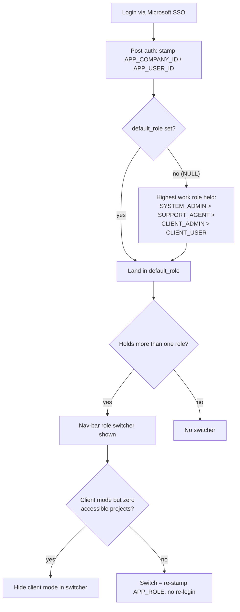

**Rules:** landing precedence `SYSTEM_ADMIN > SUPPORT_AGENT > CLIENT_ADMIN > CLIENT_USER` (decision P) ·
switcher hides client mode while the accessible-project set is empty (decision Q).

---

## 2. Account creation

One flow; the chosen role shapes the form (decisions P/Q). System Admin creates any account;
a Client Admin can onboard plain client users for their own company.

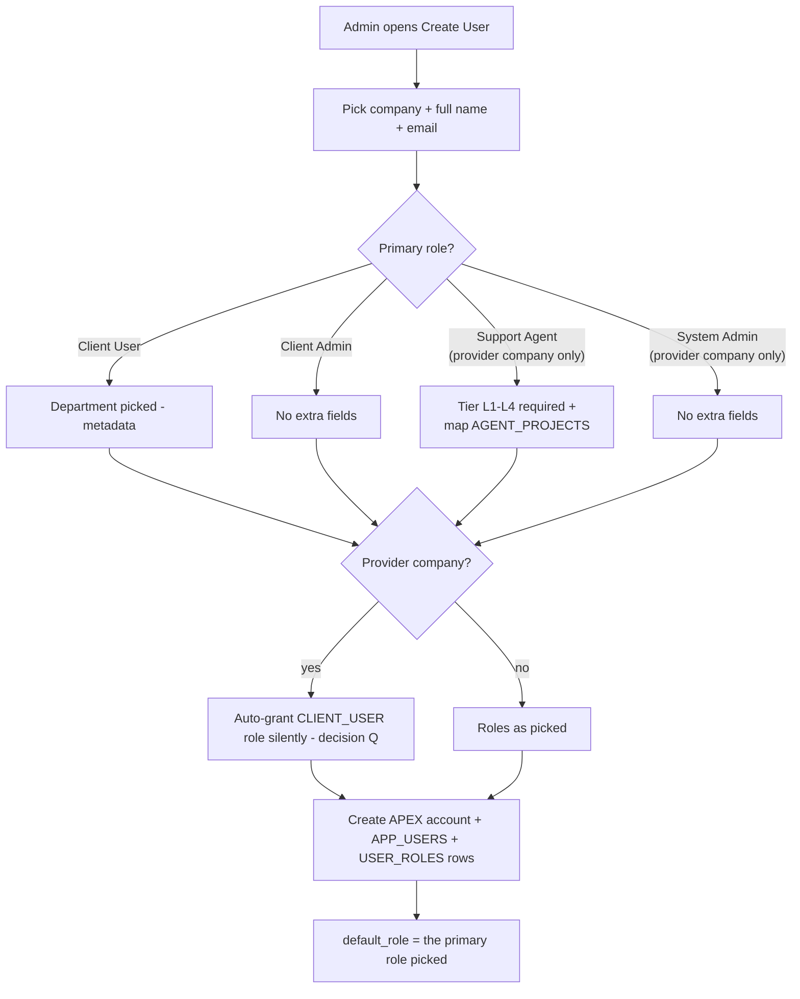

**Rules:** every provider-company user can always *be* a requester (auto-granted CLIENT_USER);
what they *see* is governed by project visibility (Flow 5) · agent creation is incomplete without
tier + at least the intended `AGENT_PROJECTS` mapping (Flow 4 covers changes later).

---

## 3. Project creation & support team setup

Creating the engagement and staffing it happen in one continuous flow, so a project can never go
live in a broken state (empty client-assignment LOV, dead escalation chain).

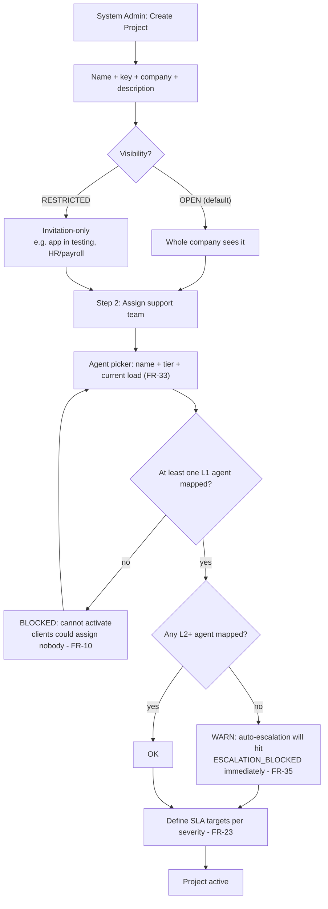

**Rules:** ≥1 L1 is a **hard gate** (prevents FR-10's empty-LOV edge) · missing higher tiers is a
**soft warning** (small projects may accept it) · SLA targets per severity per project (FR-23)
complete the setup.

---

## 4. Support team changes (AGENT_PROJECTS)

Two doors into the same table; System Admin only. **Removal rule (decided 2026-07-03): block while
the agent holds open tickets in that project** — reassign first, then remove.

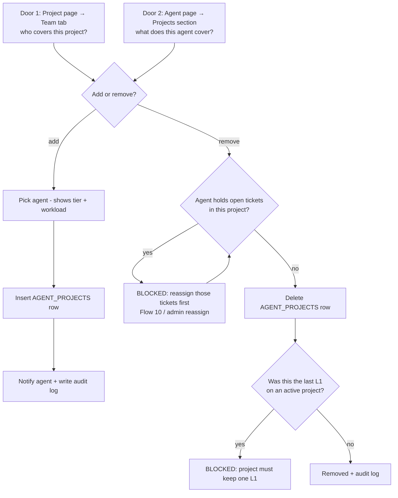

**Rules:** removal can never orphan open work (option A — block) · the ≥1-L1 gate from Flow 3
holds for the project's whole life, not just at creation.

---

## 5. Project visibility & invitations

What a client-side user can access, under decision Q. `USER_PROJECTS` is an **invitation list** —
rows grant access to Restricted projects; Open projects need no setup.

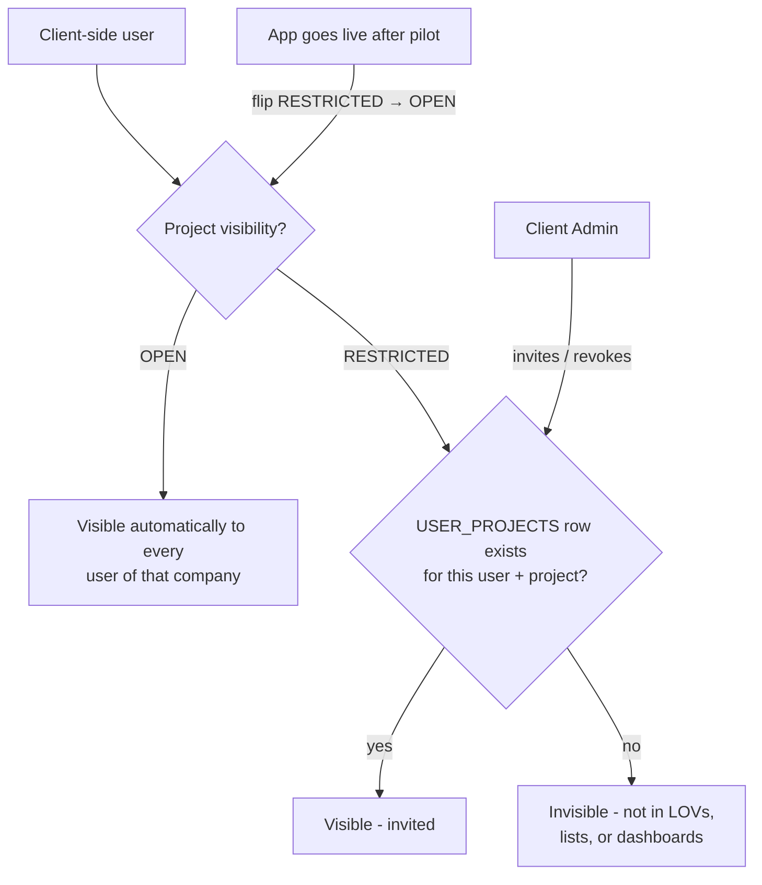

**Rules:** Client Admin sees all company tickets regardless (by role) · agents are ordinary
requesters here — Open projects visible, Restricted keep them out like everyone else ·
one flag flip at go-live replaces per-user cleanup.

---

## 6. Raise a ticket

The project question comes first, and the system **never guesses it** — a ticket lands in a
project only through an explicit choice or context the user visibly navigated through
(prevents mis-filed tickets; decided 2026-07-03).

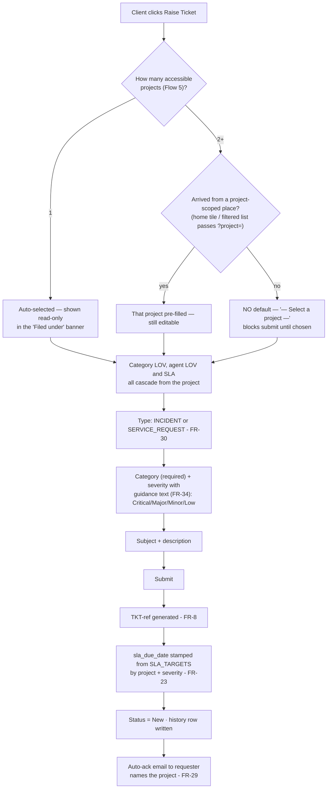

**Rules:** never default to "first project in the list" — pre-fill only from explicit navigation
context (`?project=`) or when exactly one project is accessible · the cascade makes a wrong pick
self-evident (wrong categories/agents = immediate error signal) · the ack email naming the project
lets the requester catch a mis-file within minutes · severity = client's business impact; priority
stays NULL until support triages (FR-7/K) · `company_id` + `project_id` + `department_id`
(metadata) stamped at creation.

---

## 7. Assignment (three doors)

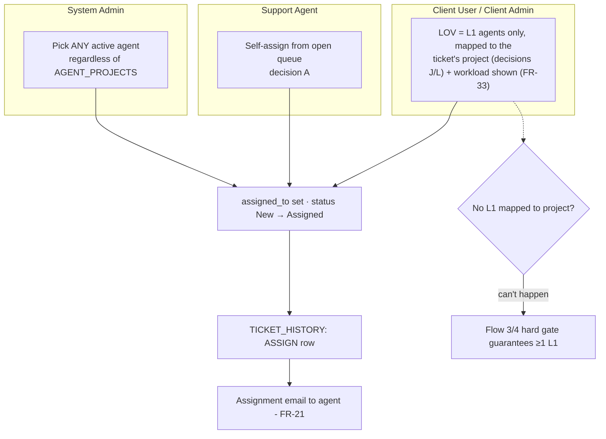

**Rules:** clients reach *first-line* support only; higher tiers via reassignment (Flow 10) ·
a Client User can assign on tickets they can see; a Client Admin on any company ticket (FR-10).

---

## 8. Ticket lifecycle

The core state machine (decision B). Every transition writes `TICKET_HISTORY` (FR-12).

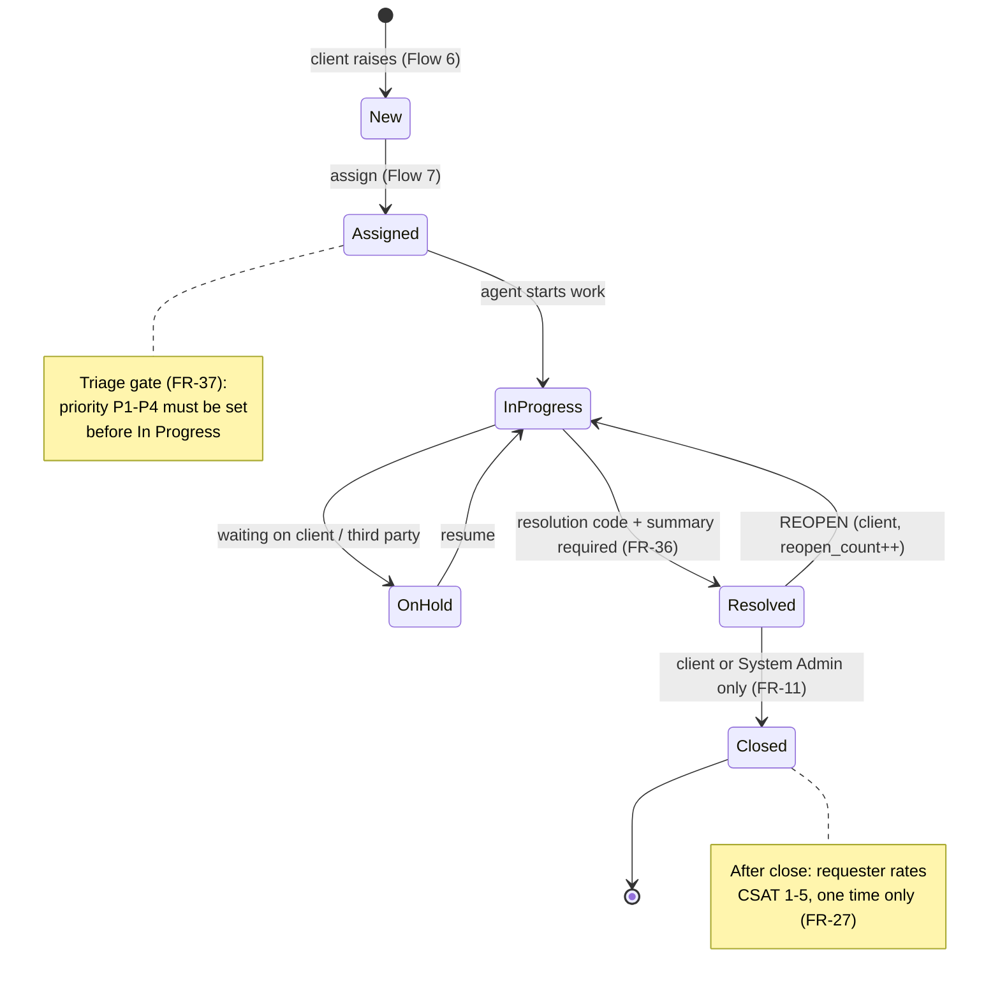

**Rules:** agent **cannot** close — only the client (or System Admin) confirms the fix (FR-11) ·
first agent response stamps `first_response_at` (FR-31) · resolution codes:
`FIXED / WORKAROUND / KNOWN_ERROR / CANNOT_REPRODUCE / DUPLICATE / USER_EDUCATION / NOT_AN_INCIDENT`.

---

## 9. Auto-escalation on SLA risk

System-driven (FR-35, decision G). Scheduler runs every 5 minutes.

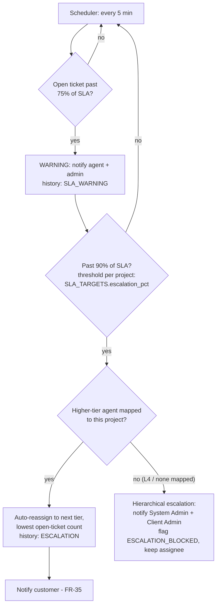

**Rules:** functional escalation stays *within the ticket's project team* — which is why Flow 3
warns when a project has no L2+ · thresholds are per project/severity.

---

## 10. Manual reassign to higher tier

FR-26 — an agent hands a ticket up when it exceeds their tier.

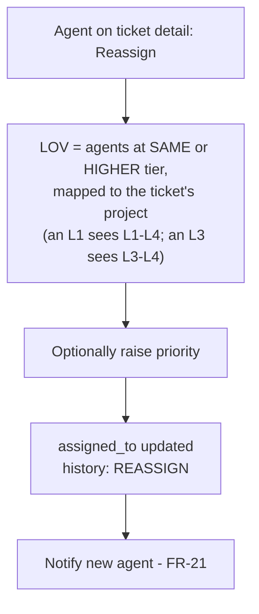

**Rules:** downward reassignment is not offered in the LOV · System Admin is unconstrained
(any agent, any direction).

---

## 11. Notifications map

All via `APEX_MAIL`; each event also lands in `TICKET_HISTORY`.

| Event | Who is notified | FR |
|---|---|---|
| Ticket created | Requester (auto-ack) | FR-29 |
| Ticket assigned / reassigned | The agent | FR-21 |
| Status changed | Requester | FR-22 |
| Comment added by client | Assigned agent | FR-38 |
| Comment added by agent (non-internal) | Requester | FR-38 |
| SLA 75% warning | Agent + System Admin | FR-35 |
| SLA 90% auto-escalation | New agent + customer | FR-35 |
| Escalation blocked | System Admin + Client Admin | FR-35 |
| Added to a project's support team | The agent | Flow 4 |

---

## 12. Admin console map

How the ADMINISTRATION pages relate to the tables and to each other
(full rationale: [admin-console spec](superpowers/specs/2026-07-03-admin-console-design.md)).
Guiding idea: **flat pages browse, the Project Detail hub configures.**

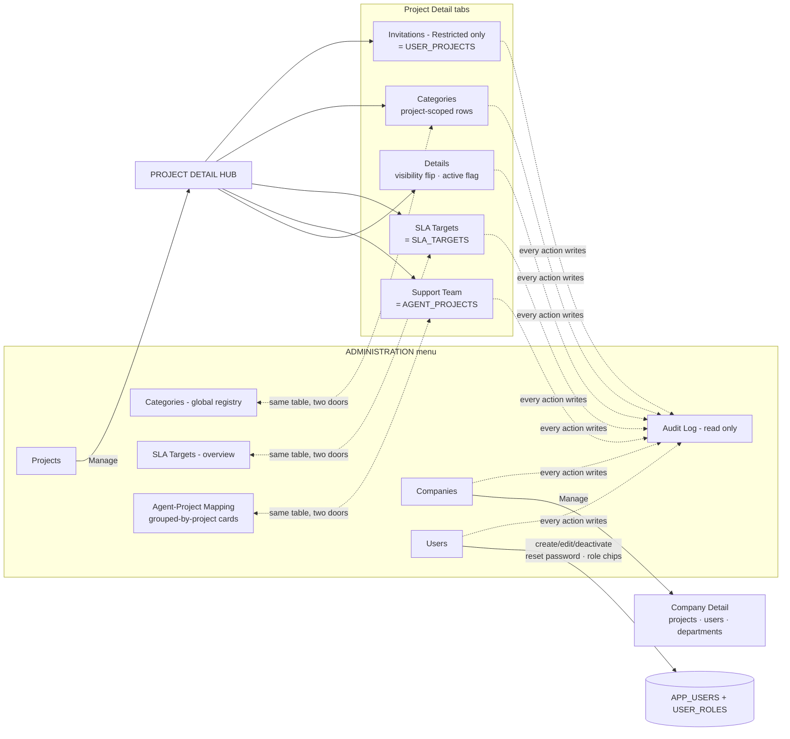

**Key rules:** project `company` is immutable after creation · users are deactivated,
never deleted · the L1 hard gate and open-ticket removal block (Flows 3/4) are enforced in
both doors to `AGENT_PROJECTS` · audit log page design unchanged — its event vocabulary grows
(visibility flips, team changes, invitations, SLA edits, role changes, password resets).

---

*Living document — update alongside the brief; fold Flow 3/4/12 decisions into the brief at the
finalization pass (with `/sync-docs`).*
