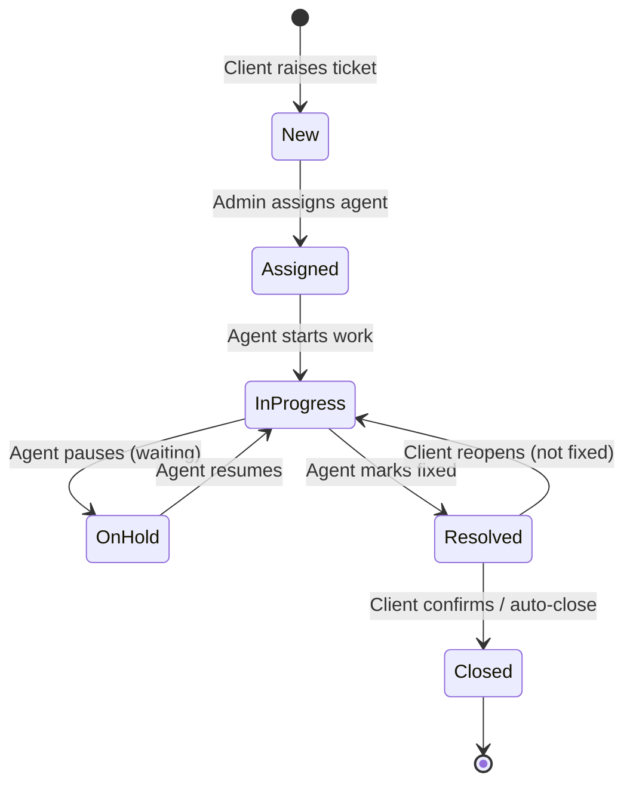
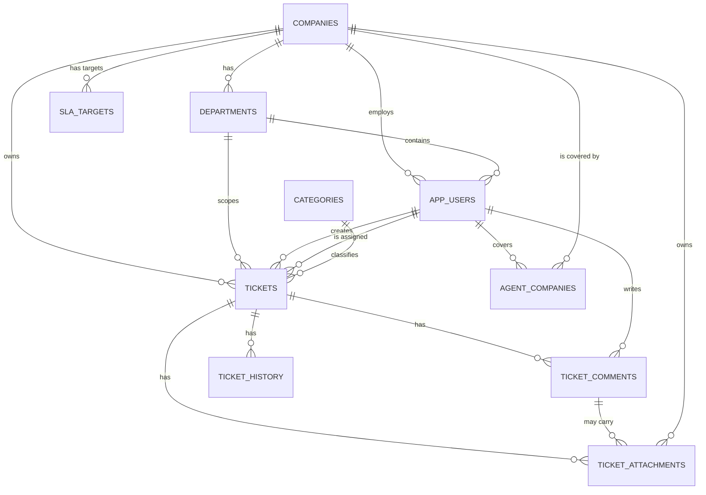

# Service Desk Ticketing System — Project Brief

**Prepared for:** Hackathon team kickoff meeting
**Date:** 2026-06-30
**Status:** Draft for team discussion — nothing here is final until the team agrees
**Timebox:** Hackathon demo on **16 July 2026** · Continues as a **production system** afterward · Platform: Oracle APEX 26.1 (company instance)
**Framework:** ITIL 4 (Incident Management + Service Request Management practices)

---

## How to use this document

This brief is the agenda for our first working session. We discuss it in this order, because each part feeds the next:

1. **Functional requirements** — *what* the system must let people do (the contract)
2. **Workflow** — the behavior those requirements demand: what happens to a ticket from birth to death
3. **Database** — the tables that store everything the requirements and workflow need (APEX is database-first; this is the foundation)
4. **Goals & task distribution** — only after 1–3 are agreed, we split the work

> **Why this order:** requirements tell us what to build; the workflow shows how the main entity behaves; only then do we know exactly what the database must hold. Design tables too early and we model for features we won't build — or miss columns for ones we will.

> **Ground rule for the meeting:** we are not trying to design a perfect Jira replacement. We are designing the *smallest system that fully works and demos well* for the 16 July hackathon, then hardening it into a production system following ITIL best practices. Protecting a working demo beats adding features. Every time.

---

## 1. The Big Picture (read this first)

### What we're building
A **multi-tenant service desk** — a self-hosted alternative to expensive tools like Jira Service Management / Zendesk — for our company to adopt. Built following **ITIL 4 Incident Management and Service Request Management** best practices.

Our company is a **vendor** that provides support and services to **multiple client companies**. This system is where:

- **Clients** raise support tickets and track them
- **Our support staff** triage, assign, and resolve those tickets
- **Management** oversees everything across all clients

### Why this is a strong project
- **Clear business value:** replaces an expensive third-party tool with something we own.
- **Plays to APEX's strengths:** APEX has built-in authentication, role-based access control, and reporting — exactly what this app needs. We build *with* the platform, not against it.
- **Demos beautifully:** the "each client sees only their own tickets, but we see everything" contrast is a 30-second wow moment for judges.

### What the judges explicitly asked for (non-negotiable)
1. **Role-based access** — different users can do different things
2. **Multiple companies** — multi-tenancy: clients are isolated from each other
3. **Ticket assignment** — assign a ticket to a support agent
4. **Dashboard** — visual overview of tickets

### Our context & constraints
| Factor | Reality | Implication |
|---|---|---|
| **Team** | Mixed — some developers, some non-devs | Split work so non-devs own real, valuable declarative pieces (forms, reports, UI, test data, testing) |
| **APEX experience** | All new to APEX | Budget time for learning. Keep techniques simple and proven. |
| **Environment** | Company APEX instance ready | No setup delay — we can build day one |
| **Timeline** | Hackathon demo: **16 July 2026**; system continues as **production** afterward | Working core first, breadth second, polish third for the demo. Production hardening follows. |
| **Framework** | ITIL 4 (Incident + Service Request Management) | Terminology, lifecycle, SLA, and escalation follow ITIL best practices |
| **Judged on** | Working end-to-end demo · feature breadth · UI/UX polish | In that priority order. A broken feature scores worse than a missing one. |

### Scope — what's in, what's out
We organize features by priority so we **always have a working demo**, even if later items slip.

**MUST — this IS the product. The demo dies without these.**
- Companies (tenants) and Users with roles
- Login + role-based access with **strict tenant isolation** (clients see only their own company)
- Create / view / edit a ticket, with full status lifecycle
- **Assign** a ticket to a support agent
- Comments + activity history on each ticket
- **Dashboard** (judge-requested)

**SHOULD — this is where we earn "breadth + polish" points.**
- Categories & priorities with filtering and search
- Clean, branded UI theme
- Email (or in-app) notification when a ticket is assigned
- **Status-change notification** to client on every lifecycle transition (FR-22, ITIL)
- **CSAT rating** after a ticket is closed (native APEX *Star Rating* item)
- **Dashboard analytics:** average resolution time + tickets handled per agent + **SLA Compliance %** (FR-32)
- **Auto-acknowledgement email** when a ticket is raised (`APEX_MAIL.SEND`)
- **"Reassign" action** on a ticket — reassign to higher-tier agent + optionally raise priority, written to history (FR-26)
- **Auto-escalation** on SLA breach — system-driven reassignment + management notification via `DBMS_SCHEDULER` (FR-35)
- **SLA per severity, per project (company)** with breach highlighting — `SLA_TARGETS` table keyed on `(company_id, severity)`, colour-coded indicators (FR-23)
- **Ticket type** (Incident / Service Request) — ITIL foundational distinction (FR-30)
- **First-response tracking** with response SLA breach indicator (FR-31)
- **Workload visibility** in assignment LOV (FR-33)
- **Severity guidance** text on Create Ticket form (FR-34)

**COULD — only if we finish MUST + SHOULD early. Do NOT commit to these.**
- AI assist (APEX has a built-in `APEX_AI` package — e.g. auto-suggest a ticket's category/priority). Strong demo moment *if* time allows.
- **File / screenshot attachments** on tickets (proof/evidence) — almost entirely declarative; build-ready DDL + isolation plan in §5.1
- Knowledge base

> **Lead's recommendation:** cut AI entirely. SLA breach highlighting is promoted to **SHOULD** — it's cheap (a lookup table + a computed column + conditional formatting) and gives the demo a production feel. The SHOULD items above are all verified feasible in APEX 26.1 and low-cost, so they're worth committing to.

**FUTURE / WON'T (this time) — explicitly out of scope for the hackathon demo; recorded for the production roadmap.**
*The MoSCoW "Won't-have-this-time" tier: not built before the 16 July demo, but captured so the vision is on record and the ideas don't leak into the build. Unlike a typical hackathon, this system continues as a **production product** — these items form the real backlog, prioritized by ITIL importance.*

**P1 — Critical (first production sprint after hackathon):**
- **Separate Incident and Service Request workflows** — distinct lifecycles and approval gates per ticket type (the SHOULD adds the field; this adds the differentiated process). ITIL's foundational distinction.
- **SLA pause on On Hold + business-hours calendar** — stop the SLA clock when waiting on the client; measure SLA in business hours, not wall-clock time. Without these, SLA metrics are inaccurate.
- **Production-grade tenant isolation via VPD / RLS** — graduate from app-item + `WHERE company_id` (§5) to database-enforced row security.

**P2 — High:**
- **Hierarchical escalation** — management notification when SLA is at risk or a major incident occurs (distinct from functional escalation / reassignment).
- **Major Incident process** — dedicated workflow for Critical/P1 issues: separate communication cadence, post-incident review (PIR), ability to link child/related tickets to a major incident parent.
- **Two-level categorization** — `parent_category_id` self-referential FK on CATEGORIES for Category → Subcategory hierarchy. Enables trend analysis and feeds problem management.
- **Service Request catalog / ticket templates** — pre-defined request types with pre-populated fields and specific SLAs. Reduces ticket creation time, standardizes requests.
- **Auto-close after timeout** — tickets in "Resolved" for >5 business days auto-close with notification. Configurable period.
- **Advanced SLA engine** — business-hours calendars, configurable escalation policies per tier, SLA reporting by client. The SHOULD items cover per-company targets + auto-escalation; this is the full enterprise engine.

**P3 — Medium:**
- **CSAT enhancement** — free-text comment field alongside score, low-score alerts to management, CSAT trend reporting on dashboard.
- **Full ITIL KPI dashboard** — reopen rate, backlog aging, first-response time chart, CSAT average, incident volume trend (sparkline/time-series).
- **Urgency field + Impact × Urgency = Priority matrix** — the textbook ITIL priority model; auto-suggests priority from severity (impact) + urgency. Removes subjectivity.
- **Problem Management** — Problem records, known errors, link recurring incidents to root causes. First step toward proactive service.
- **Auto-assignment rules** — round-robin, load-balanced, or skill-based routing. Scales assignment beyond manual selection.
- **Exportable / scheduled management reports** — periodic PDF/Excel reports via `APEX_DATA_EXPORT` + `DBMS_SCHEDULER`.

**P4 — Low:**
- **Knowledge base** with article-to-incident linking — graduates the COULD KB into a searchable, agent-facing tool (reduce resolution time for known issues).
- **Incident Manager role separation** from System Admin — only needed when team grows beyond a handful of agents.
- **Attachments at scale** — OCI Object Storage instead of DB BLOBs, plus virus/malware scanning (the COULD item is the DB-BLOB MVP; see §5.1).
- **Project Lead role** — the deferred `is_lead` flag on `AGENT_COMPANIES` (§2): assign teammates' work within a project *and* work tickets.
- **Email-to-ticket intake** — clients raise tickets by emailing a support address (inbound mail → `TICKETS`).
- **SSO / corporate directory login** — SAML/OAuth instead of email + password.
- **Self-service knowledge base & portal** — public-facing help centre.
- **Change Management linkage** — link incident resolution to formal change records when a fix requires a change.
- **CMDB / Service Catalog integration** — link incidents to affected configuration items / services.
- **Chat / integrations** — Slack/Teams webhooks, native mobile app.
- **Continual Improvement register** — structured review of incident trends + improvement tracking (process/governance, not technology).

> **Why have this tier at all:** it's the firewall against scope creep before the demo. Every "ooh, could we also…" idea gets parked here instead of derailing the July 16 milestone — and it doubles as the slide that answers a judge's "where would you take this next?" Post-hackathon, these become the real production backlog, prioritized by ITIL importance (P1–P4 above).

---

## 2. Roles & Access (the backbone)

Two sides: the **client side** (our customers) and the **vendor side** (our company). Each role answers: *who are they, what can they see, what can they do.*

| Role | Who they are | Can **see** | Can **do** |
|---|---|---|---|
| **Client User** | Everyday employee at a client company (has the problem) | All tickets in **their department** (never other departments or companies) | Raise a ticket, comment, view status, **assign an L1 agent** from agents mapped to their company (decision J/L) |
| **Client Admin** | Coordinator/manager at a client company | **All tickets for their own company** (cross-department — never other companies') | Everything a Client User can + oversee their company's tickets, raise on behalf of staff, see their company dashboard, **assign/reassign agents** for any company ticket |
| **Support Agent** | Our support staff who do the work (tiered L1–L4, decision M) | Tickets in **their assigned projects** (the clients they cover) — never clients they're not on | Work tickets: change status, comment, resolve, **reassign to higher tier**. Cannot manage users/companies |
| **System Admin** | Our manager/lead (likely the team lead) | **Everything**, across all companies | Manage companies & users, **assign/reassign** tickets, configure system, see global dashboard |

- **Multi-company isolation** lives in the jump from *Client Admin* (one company) to *System Admin* (all companies).
- **Assignment** can come from three sources: *System Admin* (any agent), *Support Agent* self-assign (from the open queue), or *Client User / Client Admin* (from **L1 agents only** mapped to their company via `AGENT_COMPANIES` — decisions J/L).

> **Decision (A) — ✅ confirmed:** A Support Agent **can self-assign** from the open queue, **and** the System Admin assigns/reassigns anyone. (Self-assign = an `IS_AGENT`-gated button on the queue/detail that sets `assigned_to = :APP_USER_ID`, moves status to *Assigned*, and writes a `TICKET_HISTORY` row — the same process the Admin's assign action uses.)

> **Decision (I) — ✅ confirmed: agents are scoped to their projects.** Our staff each work specific clients, not all of them. So a Support Agent only sees tickets for the **client companies (projects) they're assigned to** — never clients they're not on. This kills cross-project "noise". Mechanism: a small join table **`AGENT_COMPANIES`** (`user_id` + `company_id`); the queue/dashboard filter `WHERE company_id IN (the agent's covered companies)`. System Admin is exempt (sees every company by role). *Within* a covered project an agent sees the whole project's tickets (team visibility), but can only change status on tickets assigned to them or unassigned.

> **Decision (L) — ✅ confirmed: clients assign L1 agents only.** Clients (Client User / Client Admin) can assign from agents mapped to their company, but the LOV is filtered to `tier = 'L1'` only. Higher tiers are reached via reassignment by support staff. Rationale: clients go to first-line support, not directly to senior specialists.

> **Decision (M) — ✅ confirmed: agents have explicit L1–L4 tiers.** Each support agent carries a `tier` field (L1/L2/L3/L4) on `APP_USERS`. L1 = first-line (general triage), L2 = specialist, L3 = senior/escalation, L4 = expert/vendor. Tiers drive assignment visibility (clients see L1 only) and reassignment flow. *(Reverses earlier Decision I which said "no per-agent level field" — manager feedback 2026-07-02.)*

> **Decision (N) — ✅ confirmed: client visibility is department-scoped.** A Client User sees all tickets from **their department**, not just their own and not the whole company. A Client Admin sees cross-department (all company tickets). Rationale: team awareness without cross-department sensitive info leakage. Mechanism: `DEPARTMENTS` table + `department_id` on `APP_USERS` and `TICKETS`.

> **Four roles are enough — these are *not* extra roles:**
> - **Manager** (sees everything, never works tickets) = a System Admin/overseer who simply doesn't use the action buttons. We don't hard-block them, so no separate role is needed.
> - **L1 / L2 / L3 / L4 tiers** = a `tier` column on `APP_USERS` (decision M). Reassignment between tiers is a manual action (FR-26); automatic escalation on SLA breach is system-driven (FR-35).
> - **Project Lead** (assigns teammates' work within a project *and* works tickets) = deferred. For v1, assigning is the System Admin's job (plus agents self-assign). If wanted later, it returns as a **"lead" flag on `AGENT_COMPANIES`**, not a new role.

---

## 3. FUNCTIONAL REQUIREMENTS (discuss first)

Concrete "the system must…" statements, grouped by area. In the meeting, confirm each tag as **MUST / SHOULD / COULD**. These requirements are what the workflow (§4) and database (§5) must then support.

### Authentication & access
- FR-1: A user can log in with email + password. *(MUST)*
- FR-2: After login, the system knows the user's role and company. *(MUST)*
- FR-3: A user only sees pages and actions allowed for their role. *(MUST)*
- FR-4: A client user only sees data belonging to their own company and **department** (decision N). A Client Admin sees all company data cross-department. *(MUST)*

### Companies & users (admin)
- FR-5: System Admin can create/edit/deactivate companies. *(MUST)*
- FR-6: System Admin can create/edit/deactivate users and assign each a role + company. *(MUST)*

### Tickets — core
- FR-7: A client can raise a ticket (subject, description, category, **severity**). **Severity** (Critical/Major/Minor/Low) is set by the client to describe business impact; **Priority** (P1–P4 / Urgent/High/Medium/Low) is set by the support team to determine work order. Both fields live on the ticket; only severity is required at creation. *(MUST)*
- FR-8: Each ticket gets a unique human-friendly reference (e.g. TKT-00001). *(MUST)*
- FR-9: A user can view a ticket's full detail, including its comments and history. *(MUST)*
- FR-10: A ticket can be assigned/reassigned to a support agent. System Admin can assign any agent; **clients (Client User or Client Admin) can assign from L1 agents only** mapped to their company via `AGENT_COMPANIES` (decisions J/L); Support Agents can self-assign from the open queue (decision A). *(MUST)*
- FR-11: A support agent can change a ticket's status per the workflow rules. *(MUST)*
- FR-12: Any state change is recorded in ticket history (who/what/when). *(MUST)*
- FR-13: Users can add comments to a ticket. *(MUST)*
- FR-14: Agents can mark a comment as internal (not visible to the client). *(SHOULD)*
- FR-26: A support agent/lead can **reassign** a ticket to a higher-tier agent (e.g. L1→L2) and optionally raise priority; the reassignment is written to history. *(SHOULD)*

### Feedback & closure
- FR-27: After a ticket is **Closed**, the requester can rate the support experience (CSAT, e.g. 1–5 stars). *(SHOULD)*

### Finding & filtering
- FR-15: Agents/admins can see a list of all tickets they're allowed to see, filterable by status, priority, severity, company, assignee. The list includes a computed **ticket age** column (`SYSDATE − created_at`) and, when FR-23 is built, the **SLA breach indicator**. *(MUST)*
- FR-16: Users can search tickets by reference or keyword. *(SHOULD)*

### Dashboard (judge-requested)
- FR-17: A dashboard shows ticket counts by status. *(MUST)*
- FR-18: The dashboard shows counts by priority and by client company. *(MUST)*
- FR-19: The dashboard respects the viewer's role (a Client Admin sees only their company; System Admin sees all). *(MUST)*
- FR-20: The dashboard shows simple charts (bar/pie), not just numbers. *(SHOULD)*
- FR-28: The dashboard shows operational analytics — **average resolution time** and **tickets handled per agent** (JET chart + KPI regions over plain SQL). *(SHOULD)*

### Notifications (breadth)
- FR-21: When a ticket is assigned, the agent is notified (email or in-app). *(SHOULD)*
- FR-29: When a ticket is **created**, the requester receives an automatic acknowledgement email (`APEX_MAIL.SEND`). *(SHOULD)*
- FR-22: When a client's ticket changes status, they are notified via email (`APEX_MAIL`). Promoted from COULD per ITIL: communication at every lifecycle touchpoint. *(SHOULD)*

### ITIL alignment (added 2026-07-02 — ITIL 4 audit recommendations)
- FR-30: Each ticket has a **ticket type** field: `INCIDENT` (unplanned interruption / break-fix) or `SERVICE_REQUEST` (pre-defined request — e.g. new account, access, information). Default `INCIDENT`. Exposed on the Create Ticket form and the dashboard (separate counts per type). This is the **foundational ITIL distinction** between Incident Management and Service Request Management. *(SHOULD)*
- FR-31: **First-response time tracking.** A `first_response_at` timestamp on TICKETS is stamped when a support agent first comments or moves the ticket from New/Assigned to In Progress — whichever comes first. The ticket list shows a **response SLA breach indicator** (comparing `first_response_at − created_at` against `SLA_TARGETS.response_hours`). *(SHOULD)*
- FR-32: The dashboard includes an **SLA Compliance % KPI card** — `COUNT(tickets resolved before sla_due_date) / COUNT(resolved tickets) × 100`. The single most important ITIL metric. *(SHOULD)*
- FR-33: The assignment LOV shows each agent's **open ticket count** (workload visibility) so assigners can load-balance. *(SHOULD)*
- FR-34: The Create Ticket form shows a **one-line severity guidance** next to each option (e.g. "Critical — Complete service outage affecting all users") to reduce severity inflation. *(SHOULD)*

### SLA & aging
- FR-23: **SLA target per severity, per project (company)** with declarative breach highlighting (computed at query time). The `SLA_TARGETS` table maps each `company_id` + `severity` combination to `response_hours` and `resolution_days`; on ticket creation, `sla_due_date` is stamped (`created_at + resolution_days` from the matching target). The ticket list shows a colour-coded breach indicator (🟢 On track / 🟡 At risk / 🔴 Breached). Vendor-managed (System Admin configures per client). *(SHOULD)*
- FR-35: **Auto-escalation on SLA breach.** A scheduled job (`DBMS_SCHEDULER`) checks tickets approaching their `sla_due_date`. At a configurable threshold (e.g. 80% of SLA elapsed), the system automatically reassigns the ticket to a higher-tier agent and notifies the System Admin. Written to `TICKET_HISTORY` as an `ESCALATION` action. This is **system-driven escalation** (distinct from manual reassignment in FR-26). *(SHOULD)*

### Stretch (do not commit)
- FR-24: AI auto-suggests category/priority from the description (`APEX_AI`). *(COULD)*
- FR-25: **File / screenshot attachments** on a ticket (and optionally on a comment) as proof/evidence, so an agent can view or download them while working the ticket. Uploaded via a declarative *File Browse* item, stored in a `TICKET_ATTACHMENTS` BLOB table, displayed as a download link (and inline preview for images). **Subject to the same `company_id` tenant scoping as everything else** (see §5.1). *(COULD)*

---

## 4. WORKFLOW — the ticket lifecycle

The requirements above center on one entity: the ticket. It moves through **states**, and only certain roles can trigger certain moves. This is the heart of the app.

### The states
| State | Meaning |
|---|---|
| **New** | Just raised by a client. Not yet assigned. |
| **Assigned** | An agent has been put on it, but work hasn't started. |
| **In Progress** | The agent is actively working on it. |
| **On Hold** | Paused — waiting on the client, a third party, or parts. |
| **Resolved** | Agent believes it's fixed; awaiting client confirmation. |
| **Closed** | Confirmed done. The end. |

### The lifecycle (state diagram)


### Who can do each transition
| Transition | From → To | Who triggers it |
|---|---|---|
| Raise ticket | — → New | Client User, Client Admin |
| Assign | New → Assigned | System Admin, Support Agent self-assign *(decision A)*, **or** Client User / Client Admin from agents mapped to their company *(decision J)* |
| Start work | Assigned → In Progress | Support Agent |
| Put on hold | In Progress → On Hold | Support Agent |
| Resume | On Hold → In Progress | Support Agent |
| Resolve | In Progress → Resolved | Support Agent |
| Close | Resolved → Closed | Client (confirm) or System Admin |
| Reopen | Resolved → In Progress | Client User, Client Admin |
| **Reassign (tier transfer)** | In Progress → In Progress *(reassign to higher tier + optionally raise priority)* | Support Agent / System Admin *(FR-26)* |
| **Escalation (auto)** | Any open state *(system reassigns + notifies management on SLA breach)* | System (`DBMS_SCHEDULER` job, FR-35) |

> **Reassign** (FR-26) is a manual action — a support agent or admin moves a ticket to a higher-tier agent (e.g. L1→L2), optionally raising priority. It writes a `TICKET_HISTORY` row with action `REASSIGN`. **Escalation** (FR-35) is system-driven — when SLA is at risk (e.g. 80% elapsed), the system automatically reassigns to a higher tier and notifies management, logged as `ESCALATION`.

> **Open decision for the meeting (B):** Do we want **On Hold** and **Reopen** in v1, or is the simpler `New → Assigned → In Progress → Resolved → Closed` enough for the demo? Fewer states = faster build. We can always add them back.

> **Key rule:** *every* state change is written to the ticket history (who, what, when). That history powers both the activity log (FR-12) and the dashboard.

---

## 5. DATABASE — the data model

Now that we know the requirements and workflow, we can model the data to support them. APEX is database-first: get these tables right and the screens almost build themselves. Get them wrong and we rebuild everything. **This is the most important technical decision in the meeting.**

### The tables (entities)
| Table | What it holds | Key columns |
|---|---|---|
| **COMPANIES** | Every company — our vendor company *and* each client | `company_id` (PK), `company_name`, `company_type` (VENDOR / CLIENT), `status` |
| **DEPARTMENTS** | Departments within a company (decision N) | `department_id` (PK), `company_id` (FK), `department_name` |
| **APP_USERS** | Every person who logs in | `user_id` (PK), `company_id` (FK), `department_id` (FK, nullable — vendor staff may not need one), `full_name`, `email`, `role`, **`tier`** (L1/L2/L3/L4 — for Support Agents, decision M), `status` |
| **TICKETS** | The support requests | `ticket_id` (PK), `ticket_ref` (e.g. TKT-00001), `company_id` (FK — *the tenant key*), `department_id` (FK — stamped from creator's department, decision N), **`ticket_type`** (`INCIDENT` / `SERVICE_REQUEST` — default `INCIDENT`, FR-30), `subject`, `description`, `category_id` (FK), **`severity`** (Critical/Major/Minor/Low — client-set at creation), **`priority`** (P1–P4 — support-set, nullable until triaged), `status`, `created_by` (FK user), `assigned_to` (FK user, nullable), `created_at`, `updated_at`, **`first_response_at`** (TIMESTAMP — stamped on first agent response, FR-31), `resolved_at`, `closed_at`, `csat_score` (NUMBER, nullable — set at closure, FR-27), **`sla_due_date`** (DATE — stamped at creation from `SLA_TARGETS` based on severity, FR-23) |
| **TICKET_COMMENTS** | The conversation on a ticket | `comment_id` (PK), `ticket_id` (FK), `user_id` (FK), `comment_text`, `is_internal` (Y/N — internal note vs client-visible), `created_at` |
| **TICKET_HISTORY** | Audit trail of every change | `history_id` (PK), `ticket_id` (FK), `user_id` (FK), `action`, `old_value`, `new_value`, `created_at` |
| **CATEGORIES** | Ticket types (Bug, Request, Question…) | `category_id` (PK), `category_name` |
| **AGENT_COMPANIES** | Which clients (projects) each support agent covers — *the agent-scoping key (decision I)* | `user_id` (FK), `company_id` (FK); together the PK. *(Optional later: `is_lead` Y/N for the deferred Project Lead.)* |
| **SLA_TARGETS** | SLA resolution targets per severity **per company** — vendor-managed (FR-23) | `sla_target_id` (PK), `company_id` (FK — each client gets their own targets), `severity` (matches `TICKETS.severity`), `response_hours` (NUMBER), `resolution_days` (NUMBER); unique on `(company_id, severity)` |
| **TICKET_ATTACHMENTS** *(COULD — FR-25)* | Files/screenshots attached to a ticket as evidence | `attachment_id` (PK), `ticket_id` (FK), `company_id` (FK — *tenant key, denormalized on purpose; see §5.1*), `comment_id` (FK, nullable — null = ticket-level), `file_name`, `mime_type`, `file_blob` (BLOB), `uploaded_by`, `uploaded_at` |

> **Severity vs Priority (ITIL-aligned, Decision K):** Severity (Critical/Major/Minor/Low) maps to ITIL's **Impact** — the client's assessment of business disruption, set at ticket creation, required. Priority (P1/P2/P3/P4) maps to ITIL's **Priority** — the support team's work-order decision, set during triage, nullable until then. Both can start as simple fixed lists (check constraints). SLA targets key off severity, not priority. *(Post-hackathon: add an **Urgency** dimension to complete the ITIL Impact × Urgency = Priority matrix — see FUTURE P3.)*

> Statuses can start as a simple fixed list (the states in §4). If we have time, promote to lookup tables — cleaner, but not required for the demo.

> **Convention — timestamps & history vocabulary (enables aging / SLA / FRT metrics with no schema change):**
> The derived dashboard metrics — ticket **aging**, **"stale" / time-since-last-activity**, **first-response-time (FRT)**, **backlog trend**, **reopen rate** — are all pure queries over data we already store, *provided* three small rules hold. Decide these now, before the tables are built:
> 1. **One timestamp type everywhere.** `created_at`, `updated_at`, `resolved_at`, `closed_at` on every table use `TIMESTAMP WITH LOCAL TIME ZONE` (matching `TICKET_ATTACHMENTS`, §5.1). Don't mix `DATE` and `TIMESTAMP` — it complicates the age arithmetic and the display formatting.
> 2. **`TICKETS.updated_at` is bumped on *every* change** — every comment insert and every `TICKET_HISTORY` write also touches `updated_at`. "Last activity" = `GREATEST(updated_at, MAX(comment.created_at), MAX(history.created_at))`; keep the `GREATEST` form as a backstop so a ticket that's being actively commented on never falsely reads as *stale*.
> 3. **`TICKET_HISTORY.action` is a fixed enum, not free text** — `STATUS_CHANGE`, `ASSIGN`, `REASSIGN`, `ESCALATION`, `PRIORITY_CHANGE`, `COMMENT`, `CSAT` (extend as needed, but pin the list). A *Reopen* is a `STATUS_CHANGE` transitioning **from** `'Resolved'` back to an active status — detect it via `old_value = 'Resolved'` (matches the Reopen button on Page 5 of the build guide, which sets status to *In Progress*). A fixed vocabulary makes every history-driven metric a single, reliable predicate instead of guessing at spellings.
>
> Metric tiers (build only after the MUST spine demos with real isolation): **stale flag** + **overdue highlight** (age × priority — the declarative cousin of the SLA-highlight COULD) are the recommended picks; **FRT**, **backlog trend**, **reopen rate** are bonus.

### How the tables relate


> **Note:** `TICKET_ATTACHMENTS` is a COULD feature (FR-25). It carries its **own** `company_id` (copied from the parent ticket at upload) so every BLOB-download query can filter on the tenant key directly — without a join — closing the IDOR gap on file downloads. Build-ready DDL and the full isolation plan are in §5.1.

> **Note:** `AGENT_COMPANIES` is a many-to-many bridge — one agent covers several clients, one client is covered by several agents. It's what scopes an agent's queue to only their projects (decision I). It does **not** weaken client isolation: clients are still locked to their own `company_id`; this table only *narrows* what an agent sees on the vendor side.

### The single most important technical rule: tenant isolation
Every ticket carries a `company_id`. **A client must only ever see rows where `company_id` = their own company** (this is FR-4). If a Client User from Company A can see Company B's tickets, the "production-level" claim collapses.

How we enforce it (from simplest to most robust — pick based on comfort):
1. **Application item + WHERE clause** *(recommended for the hackathon):* at login, store the user's `company_id` and `role` in an APEX application item. Every client-facing report/form filters `WHERE company_id = :APP_COMPANY_ID`. Simple, visible, easy to test.
2. **Authorization schemes per role:** APEX's built-in feature controlling which pages/buttons each role can access. We use this *on top of* the WHERE-clause filtering.
3. **VPD (Virtual Private Database):** database-enforced row security. Most robust, but advanced — a stretch goal, not a starting point.

> **Open decision for the meeting (C):** confirm we go with approach **1 + 2** for v1. (Note for the demo: explicitly *show* a client logging in and seeing only their tickets — that proves the requirement live.)

### 5.1 File / screenshot attachments (FR-25 — COULD, build-ready)

A client raising a ticket — or anyone commenting — can attach a file or screenshot as proof/evidence; a support agent views or downloads it while working the ticket. This is **almost entirely declarative** in APEX (verified against the offline 26.1 reference) and is a **half-day to one-day** build, so it stays a **COULD** — only built if MUST + SHOULD finish early — but is documented here ready to go.

**How it works (declarative path, minimal PL/SQL):**
- **Upload:** a built-in **File Browse** page item. Uploads first land in APEX's session-scoped temp table (`APEX_APPLICATION_TEMP_FILES`, auto-purged at end of session) — so we point the item at a **BLOB column** instead, and APEX persists the file, filename, and mime type into `TICKET_ATTACHMENTS` with **no code** (an Interactive Grid / Form on the table).
- **Download:** a declarative **"Download BLOB" column** in a report/grid (binds filename + mime type; opens inline or forces download). No code.
- **Image preview (optional):** one `CASE` expression emitting an `` via `APEX_UTIL.GET_BLOB_FILE_SRC` for image mime types, falling back to a download link otherwise. (That column must have *Escape special characters = No*, which makes filename escaping mandatory — see below.)

**The DDL** (`company_id` denormalized onto the row — load-bearing for isolation, see below):
```sql
CREATE TABLE TICKET_ATTACHMENTS (
  ATTACHMENT_ID  NUMBER GENERATED BY DEFAULT ON NULL AS IDENTITY PRIMARY KEY,
  TICKET_ID      NUMBER NOT NULL REFERENCES TICKETS(TICKET_ID),
  COMPANY_ID     NUMBER NOT NULL REFERENCES COMPANIES(COMPANY_ID),  -- tenant key, copied from the ticket at upload
  COMMENT_ID     NUMBER REFERENCES TICKET_COMMENTS(COMMENT_ID),     -- null = ticket-level attachment
  FILE_NAME      VARCHAR2(255) NOT NULL,
  MIME_TYPE      VARCHAR2(255),
  FILE_BLOB      BLOB,
  UPLOADED_BY    VARCHAR2(255) DEFAULT SYS_CONTEXT('APEX$SESSION','APP_USER'),
  UPLOADED_AT    TIMESTAMP WITH LOCAL TIME ZONE DEFAULT SYSTIMESTAMP
);
CREATE INDEX TICKET_ATTACH_TICKET_IX  ON TICKET_ATTACHMENTS(TICKET_ID);
CREATE INDEX TICKET_ATTACH_COMPANY_IX ON TICKET_ATTACHMENTS(COMPANY_ID);
```

**The isolation plan — the one rule that cannot break (§5) applied to BLOBs.** A download URL carries the row's PK, and a malicious client can tamper with it to fetch another tenant's file (IDOR). *Hiding the link is not enough — the BLOB-fetch query itself must be tenant-scoped.* Guards, layered:
1. **Filter every attachment region/column on `company_id`** — `WHERE company_id = :APP_COMPANY_ID` (or join to `TICKETS` on its `company_id`). The declarative Download BLOB column derives its fetch from the region's SQL, so this predicate scopes the *actual download*, not just the visible link. **This is the single most important guard.**
2. **Session State Protection on** — so the PK in the URL carries a checksum and can't be freely edited; set the page items holding ticket/attachment IDs to *Restricted — may not be set from browser*.
3. **Authorization scheme per role** layered on top (`IS_CLIENT_USER` / `IS_AGENT` / etc.), consistent with §6.
4. If we use `GET_BLOB_FILE_SRC` for previews, its underlying `FILE` item's query **must also** carry the `company_id` predicate — don't rely on the report filter alone.
5. *(Stretch)* a **VPD/RLS policy** on `TICKET_ATTACHMENTS` keyed to `APP_COMPANY_ID` enforces isolation at the DB regardless of query path — the most robust option.

**Validation & XSS:** re-validate file size and mime type **server-side** in a page Validation (the client-side `accept` filter is convenience only); allowlist types (e.g. `image/*`, `application/pdf`). Filenames are user-controlled and rendered in reports, so escape with `APEX_ESCAPE.HTML(...)` (and `HTML_ATTRIBUTE(...)` inside attributes) — keep *Escape special characters = Yes* on every column except the deliberate `` preview, where you escape each interpolated value yourself.

> **Run the `tenant-isolation-auditor` agent** over the attachment region SQL and every download path before demoing — attachments add a fresh IDOR surface, and a leaked file is as fatal to the "production-level" claim as a leaked ticket.

---

## 6. APEX PAGE ARCHITECTURE — what we'll actually build

Now that the requirements, workflow, and data model are set, we can name the **screens**. This is the bridge from "what the system does" to "who builds which page." (Advisory map, grounded in APEX 26.1 — confirm in the meeting.)

### The one design rule that keeps this small
**One page serves many roles — we do *not* build one page per role.** APEX gives us two declarative levers to make a single page behave differently per role:
- **Authorization schemes** — show/hide whole pages, buttons, and columns by role.
- **Server-side filtering** — `WHERE company_id = :APP_COMPANY_ID` plus role logic in the region's SQL.

So we build the Ticket List *once*: a Client User sees only their tickets, a System Admin sees all — same page. This roughly halves the page count **and** concentrates tenant-isolation logic (§5) in a few well-tested queries instead of scattering it across role-specific clones.

> Two cross-cutting mechanisms make this work (they are *Shared Components*, not pages): **application items** `APP_COMPANY_ID` / `APP_USER_ID` / `APP_ROLE` set once at login, and one **authorization scheme per role** (`IS_CLIENT_USER`, `IS_CLIENT_ADMIN`, `IS_AGENT`, `IS_SYSTEM_ADMIN`).

### The pages (12 total → 10 MUST, 2 SHOULD)

| # | Page | APEX page type | What it's for / who uses it | Shared vs role-specific | Priority |
|---|---|---|---|---|---|
| **Auth & Shell** ||||||
| 1 | **Login** | Login Page (built-in) | Email + password sign-in; post-auth process stamps company_id/role into app items. *All roles.* | Shared | **MUST** |
| 2 | **Home / Landing** | Blank (redirect) or Cards | Routes user after login; can redirect straight to Dashboard. *All roles.* | Shared | **MUST** |
| **Dashboard** ||||||
| 3 | **Dashboard** | Cards + Chart regions | Ticket counts by status / priority / company + bar/pie charts; role-filtered. *All roles.* | Shared (role-filtered) | **MUST** |
| **Tickets (the core)** ||||||
| 4 | **Ticket List / Queue** | Faceted Search (or IR) | Main browse / filter / search screen; rows scoped by role + company. *All roles.* | Shared (role-filtered) | **MUST** |
| 5 | **Ticket Detail** | Form + Comments & History regions | View/edit one ticket; the hub of the app. Buttons gated by role. *All roles.* | Shared (buttons gated) | **MUST** |
| 6 | **Create / Raise Ticket** | Form (Modal Dialog) | Client raises a ticket (subject, description, category, **severity**). *Client User, Client Admin.* | Role-specific | **MUST** |
| 7 | **Assign / Reassign** | Form (Modal Dialog) | Put an agent on a ticket; writes history + (SHOULD) assignment email. *System Admin assigns/reassigns anyone; agents self-assign from the queue (decision A); clients assign from agents mapped to their company (decision J).* | Shared (agent list scoped by role) | **MUST** |
| 8 | **Add Comment** | Form (Modal Dialog) | Add a comment; internal-note flag for agents. *All roles (internal toggle gated).* | Shared (toggle gated) | **MUST** |
| **Admin** ||||||
| 9 | **Companies (manage)** | Interactive Grid | Create/edit/deactivate client companies (CRUD). *System Admin only.* | Role-specific | **MUST** |
| 10 | **Users (manage)** | Interactive Grid | Create/edit/deactivate users; assign role + company. *System Admin only.* | Role-specific | **MUST** |
| **Supporting** ||||||
| 11 | **Categories (manage)** | Interactive Grid | Maintain ticket categories / priorities. *System Admin.* | Role-specific | **SHOULD** |
| 12 | **My Profile** | Form | View/change own details / password. *All roles.* | Shared | **SHOULD** |

**A working, judge-satisfying demo needs only the 10 MUST pages (1–10).** If time is tight, the irreducible spine is pages **1, 3, 4, 5, 6, 7, 9, 10** — that alone hits all four judge non-negotiables (role-based access, multiple companies, assignment, dashboard).

### Things that are deliberately NOT pages
- **Status transitions** (New→Assigned→In Progress→On Hold→Resolved→Closed→Reopen) = **buttons + declarative processes on Ticket Detail**, each writing a `TICKET_HISTORY` row. Zero extra pages.
- **Comments & History** = **regions embedded in Ticket Detail** (page 5), not standalone pages.
- **Navigation menu, theme/branding, breadcrumbs** = *Shared Components*.
- **Assignment notification email** (FR-21, SHOULD) = a process on the Assign action via `APEX_MAIL`, not a page.

> This 12-page map slots straight into the workstreams below: pages 1–2 + the app-item/auth plumbing → *Data model & security*; pages 4–8 → *Ticket screens & workflow*; page 3 → *Dashboard & reporting*; pages 9–12 + theme → split between *Admin* and *UI/UX*.

### 6.1 Clickable prototype (built — review before building in APEX)
A **working, role-aware front-end prototype** of all 12 pages is live. It runs in the browser
only (HTML/CSS/JS) — **no APEX, no real database, no real authentication** — so the team can
agree on layout and flow, and rehearse the demo, *before* a line of APEX is built.

- **Live demo:** <https://apex-demo.dhawilabs.com>  (source in `docs/mockups/`)
- **Sign in:** password is `demo` for every account. Try **anna@acme.example** (Client User)
  then **sara@northwind.example** (System Admin) to see tenant isolation; **mike@northwind.example**
  is a Support Agent.
- **What it proves (the judges' four non-negotiables, live):** role-based access (nav/buttons
  change per role), multi-company isolation (a client sees only their company; admin sees all,
  and a cross-company URL is blocked), ticket assignment, and the dashboard.
- **What you can actually do:** raise → assign → start work → comment (with internal-note
  toggle) → resolve → close, with **history** and **dashboard counts** updating. Changes persist
  in the browser; **Reset demo** (top-right) restores the seed data.
- ⚠️ **This is a mockup, not the product.** The real auth, role checks, and tenant isolation are
  implemented in APEX per §5 (application items + `WHERE company_id` + authorization schemes).
  The prototype's job is to lock the UX and de-risk the build.

---

## 7. GOALS & TASK DISTRIBUTION (discuss last)

Only after the team agrees on §3–§5 do we split work. A suggested division that fits a mixed team:

| Workstream | Good fit for | Rough scope |
|---|---|---|
| **Data model & security** | Strongest dev(s) | Build the tables, relationships, login, roles, tenant isolation. *Everything depends on this — do it first.* |
| **Ticket screens & workflow** | Dev(s) | Create/view/edit ticket, assignment, status changes, comments, history |
| **Dashboard & reporting** | Dev or confident non-dev | Charts and the filtered ticket lists (APEX makes these largely declarative) |
| **UI/UX, theme & test data** | Non-dev(s) | Branding, navigation, realistic sample companies/users/tickets, walking through flows to find bugs |
| **Demo & QA** | Lead + rotating | Build the demo script, test tenant isolation hard, keep scope honest |

> **Sequencing matters more than splitting.** The data model is the dependency for everything else. Recommendation: **everyone helps lock the data model in week 1**, then fan out.

### Team ownership — 5 developers (confirmed)

Balanced by **effort, not page count** (Ticket Detail alone is ~5× a Categories grid), and dependency-aware: the Foundation must land before anyone can build a tenant-filtered page. Step-by-step build instructions per page live in [`page-build-guide.md`](page-build-guide.md).

| Owner | Workstream | Pages | Also owns |
|---|---|---|---|
| **P1 — Foundation Lead** | Foundation & Security → Demo/QA | **1** Login | 7-table schema (incl. `AGENT_COMPANIES`) + `TKT-` ref sequence, 3 app items (`APP_COMPANY_ID/USER_ID/ROLE`), 4 authorization schemes, the login post-auth process, **tenant-isolation audit across every page**, demo script |
| **P2** | Ticket Detail hub (hardest page) | **5** Ticket Detail · **8** Add Comment | Lifecycle buttons/processes (each writes `TICKET_HISTORY`), Escalate action, CSAT capture, internal-note flag, the self-assign button on detail |
| **P3** | Intake, queue & assignment | **4** Ticket List/Queue · **6** Create Ticket · **7** Assign/Reassign | Self-assign process, auto-acknowledgement email + assignment email (`APEX_MAIL`), faceted filtering/search |
| **P4** | Dashboard & data | **2** Home/Landing · **3** Dashboard | Charts + analytics (avg resolution time, per-agent counts), realistic **test data** (feeds everyone's testing) |
| **P5** | Admin & UI | **9** Companies · **10** Users · **11** Categories · **12** Profile | Theme/branding, navigation menu, breadcrumbs (Shared Components) |

**Contract between owners:** P1's app items + authorization schemes are frozen once published — everyone else only *consumes* `:APP_COMPANY_ID` and the `IS_*` schemes, never redefines them. This keeps all tenant-isolation logic in one owner's hands (§5's core rule). P2 (Page 5) and P3 (Page 4) share the `TICKETS` table — agree the column list early.

**Week 1 is shared:** all five pair with P1 to lock the data model (also how the team learns APEX together); P1 is the critical path. P4 starts test data the moment tables exist. Prove **one end-to-end slice** — Create (P3) → Detail (P2) → login/isolation (P1) — before fanning out in weeks 2–3.

### Timeline to 16 July hackathon demo (2 weeks from 2026-07-02)
- **Week 1 (2–9 Jul) — Foundation + Core:** data model, login, roles, tenant isolation, ticket CRUD, assignment, full workflow, comments, history. Goal: all MUSTs done + one end-to-end slice demoed.
- **Week 2 (9–16 Jul) — Breadth, ITIL polish & demo:** SHOULD items (ITIL FRs 30–34, SLA, CSAT, notifications, categories), UI theme, hard testing, rehearse the demo. Goal: it *looks and feels* production-level, ITIL-aligned, and the demo never breaks.
- **Post-hackathon — Production hardening:** FUTURE items (P1–P4), following ITIL roadmap. The system is real — the hackathon is the launch event, not the finish line.

---

## 8. Decisions we need to make this meeting
- **A.** ✅ **Decided:** agents self-assign from the open queue **and** the System Admin assigns/reassigns.
- **B.** Do we include *On Hold* and *Reopen* states in v1, or keep the lifecycle minimal? *(recommend: minimal first, add if time)*
- **C.** Confirm tenant isolation approach = application item + WHERE clause + authorization schemes. *(recommend: yes)*
- **D.** Confirm the MUST/SHOULD/COULD scope — anyone want to move an item?
- **E.** Confirm the workstream split and who owns what.
- **F.** Confirm the 3-week milestone shape.
- **G.** ✅ **Decided (revised): "Reassign" (manual) vs "Escalation" (automatic).** Manual tier transfer (FR-26) = agent/admin reassigns to a higher-tier agent + optionally raises priority, logged as `REASSIGN`. Automatic escalation (FR-35) = system-driven on SLA breach, logged as `ESCALATION`. The word "escalation" is reserved for system-driven actions.
- **H.** Confirm the SHOULD items (CSAT, dashboard analytics, auto-ack email, reassign, **SLA per severity per company**, auto-escalation) — all verified feasible in APEX 26.1. *(recommend: yes)*
- **I.** ✅ **Decided (revised): agents are scoped to their projects, with explicit L1–L4 tiers (decision M).** A Support Agent sees only tickets for the client companies they're assigned to (`AGENT_COMPANIES` join + `WHERE company_id IN (...)`). Each agent carries a `tier` column (L1/L2/L3/L4). Four roles stay; **Manager** = an overseer who doesn't take tickets (no separate role), **Project Lead** = deferred (`is_lead` flag later). See §2 and decision M.
- **J.** ✅ **Decided (refined with L): clients can assign L1 agents directly.** Both Client User and Client Admin can assign a support agent to their ticket — the agent LOV is scoped to `AGENT_COMPANIES` for the client's `company_id` **and filtered to `tier = 'L1'` only** (decision L). Higher tiers are reached via reassignment by support staff. System Admin can still assign/reassign anyone.
- **K.** ✅ **Decided: severity and priority are separate fields.** Severity (Critical/Major/Minor/Low) is set by the client at ticket creation to describe business impact. Priority (P1–P4) is set by the support team during triage to determine work order. SLA targets key off severity. See updated FR-7.
- **L.** ✅ **Decided (2026-07-02): clients assign L1 only.** Client assignment LOV filtered to `tier = 'L1'`. See §2 and updated FR-10.
- **M.** ✅ **Decided (2026-07-02): agents have explicit L1–L4 tiers.** `APP_USERS.tier` column. L1=first-line, L2=specialist, L3=senior, L4=expert/vendor. Reverses earlier "no level field" stance. See §2.
- **N.** ✅ **Decided (2026-07-02): client visibility is department-scoped.** Client User sees all tickets from their department; Client Admin sees cross-department. New `DEPARTMENTS` table + `department_id` on `APP_USERS` and `TICKETS`. See §2 and FR-4.

---

*This is a living document. We update it as decisions are made.*
