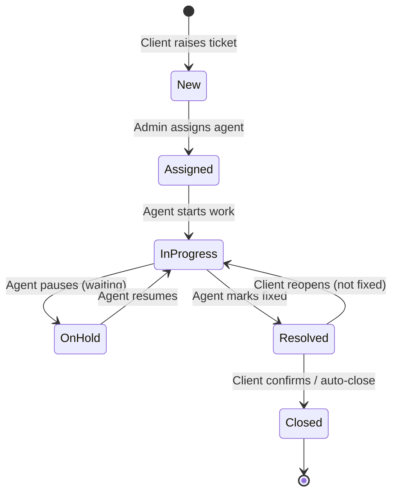
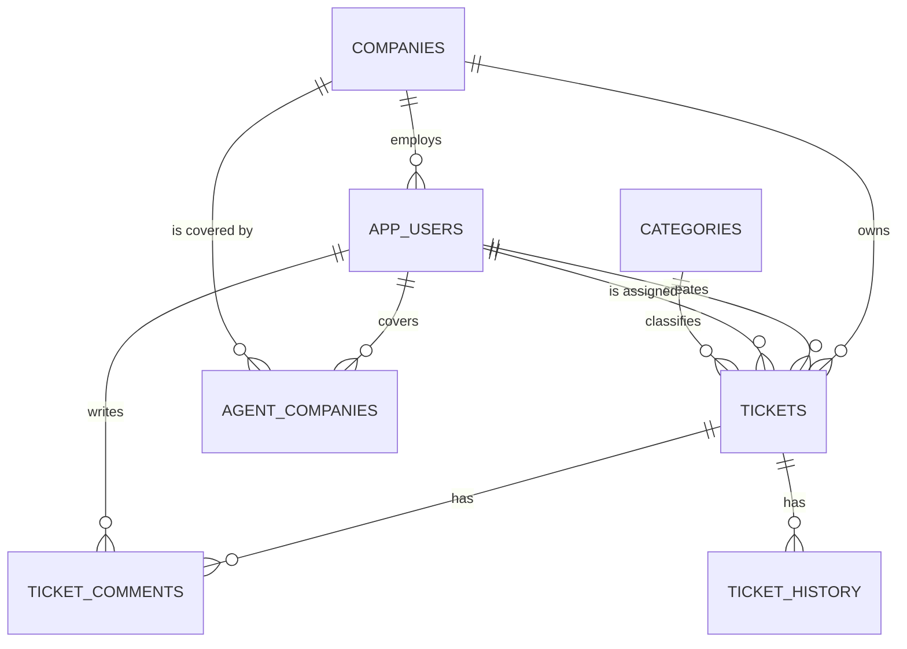

# Service Desk Ticketing System — Project Brief

**Prepared for:** Hackathon team kickoff meeting
**Date:** 2026-06-30
**Status:** Draft for team discussion — nothing here is final until the team agrees
**Timebox:** 3 weeks · Platform: Oracle APEX 26.1 (company instance)

---

## How to use this document

This brief is the agenda for our first working session. We discuss it in this order, because each part feeds the next:

1. **Functional requirements** — *what* the system must let people do (the contract)
2. **Workflow** — the behavior those requirements demand: what happens to a ticket from birth to death
3. **Database** — the tables that store everything the requirements and workflow need (APEX is database-first; this is the foundation)
4. **Goals & task distribution** — only after 1–3 are agreed, we split the work

> **Why this order:** requirements tell us what to build; the workflow shows how the main entity behaves; only then do we know exactly what the database must hold. Design tables too early and we model for features we won't build — or miss columns for ones we will.

> **Ground rule for the meeting:** we are not trying to design a perfect Jira replacement. We are designing the *smallest system that fully works and demos well*, then adding polish. Protecting a working demo beats adding features. Every time.

---

## 1. The Big Picture (read this first)

### What we're building
A **multi-tenant service desk** — a self-hosted alternative to expensive tools like Jira Service Management / Zendesk — for our company to adopt.

Our company is a **vendor** that provides support and services to **multiple client companies**. This system is where:

- **Clients** raise support tickets and track them
- **Our support staff** triage, assign, and resolve those tickets
- **Management** oversees everything across all clients

### Why this is a strong project
- **Clear business value:** replaces an expensive third-party tool with something we own.
- **Plays to APEX's strengths:** APEX has built-in authentication, role-based access control, and reporting — exactly what this app needs. We build *with* the platform, not against it.
- **Demos beautifully:** the "each client sees only their own tickets, but we see everything" contrast is a 30-second wow moment for judges.

### What the judges explicitly asked for (non-negotiable)
1. **Role-based access** — different users can do different things
2. **Multiple companies** — multi-tenancy: clients are isolated from each other
3. **Ticket assignment** — assign a ticket to a support agent
4. **Dashboard** — visual overview of tickets

### Our context & constraints
| Factor | Reality | Implication |
|---|---|---|
| **Team** | Mixed — some developers, some non-devs | Split work so non-devs own real, valuable declarative pieces (forms, reports, UI, test data, testing) |
| **APEX experience** | All new to APEX | Budget time for learning. Keep techniques simple and proven. |
| **Environment** | Company APEX instance ready | No setup delay — we can build day one |
| **Timeline** | 3 weeks | Ruthless scoping. Working core first, breadth second, polish third. |
| **Judged on** | Working end-to-end demo · feature breadth · UI/UX polish | In that priority order. A broken feature scores worse than a missing one. |

### Scope — what's in, what's out
We organize features by priority so we **always have a working demo**, even if later items slip.

**MUST — this IS the product. The demo dies without these.**
- Companies (tenants) and Users with roles
- Login + role-based access with **strict tenant isolation** (clients see only their own company)
- Create / view / edit a ticket, with full status lifecycle
- **Assign** a ticket to a support agent
- Comments + activity history on each ticket
- **Dashboard** (judge-requested)

**SHOULD — this is where we earn "breadth + polish" points.**
- Categories & priorities with filtering and search
- Clean, branded UI theme
- Email (or in-app) notification when a ticket is assigned
- **CSAT rating** after a ticket is closed (native APEX *Star Rating* item)
- **Dashboard analytics:** average resolution time + tickets handled per agent (plain SQL on the dashboard we're already building)
- **Auto-acknowledgement email** when a ticket is raised (`APEX_MAIL.SEND`)
- **"Escalate" action** on a ticket — reassign + raise priority, written to history (declarative button + process)

**COULD — only if we finish MUST + SHOULD early. Do NOT commit to these.**
- SLA breach **highlighting** (declarative, evaluated at query time — *no* timers/jobs)
- AI assist (APEX has a built-in `APEX_AI` package — e.g. auto-suggest a ticket's category/priority). Strong demo moment *if* time allows.
- File attachments, knowledge base

> **Lead's recommendation:** cut AI entirely. SLA stays COULD, but only in its cheap declarative form — a breach *highlight* on the ticket list, never background timers. The four new SHOULD items above all verified feasible in APEX 26.1 and are low-cost, so they're worth committing to.

---

## 2. Roles & Access (the backbone)

Two sides: the **client side** (our customers) and the **vendor side** (our company). Each role answers: *who are they, what can they see, what can they do.*

| Role | Who they are | Can **see** | Can **do** |
|---|---|---|---|
| **Client User** | Everyday employee at a client company (has the problem) | Only **their own** tickets | Raise a ticket, comment, view status |
| **Client Admin** | Coordinator/manager at a client company | **All tickets for their own company** (never other companies') | Everything a Client User can + oversee their company's tickets, raise on behalf of staff, see their company dashboard |
| **Support Agent** | Our support staff who do the work | Tickets in **their assigned projects** (the clients they cover) — never clients they're not on | Work tickets: change status, comment, resolve. Cannot manage users/companies |
| **System Admin** | Our manager/lead (likely the team lead) | **Everything**, across all companies | Manage companies & users, **assign/reassign** tickets, configure system, see global dashboard |

- **Multi-company isolation** lives in the jump from *Client Admin* (one company) to *System Admin* (all companies).
- **Assignment** is the *System Admin* (and optionally *Support Agent* self-assign) putting an agent on a ticket.

> **Decision (A) — ✅ confirmed:** A Support Agent **can self-assign** from the open queue, **and** the System Admin assigns/reassigns anyone. (Self-assign = an `IS_AGENT`-gated button on the queue/detail that sets `assigned_to = :APP_USER_ID`, moves status to *Assigned*, and writes a `TICKET_HISTORY` row — the same process the Admin's assign action uses.)

> **Decision (I) — ✅ confirmed: agents are scoped to their projects.** Our staff each work specific clients, not all of them. So a Support Agent only sees tickets for the **client companies (projects) they're assigned to** — never clients they're not on. This kills cross-project "noise". Mechanism: a small join table **`AGENT_COMPANIES`** (`user_id` + `company_id`); the queue/dashboard filter `WHERE company_id IN (the agent's covered companies)`. System Admin is exempt (sees every company by role). *Within* a covered project an agent sees the whole project's tickets (team visibility), but can only change status on tickets assigned to them or unassigned.

> **Four roles are enough — these are *not* extra roles:**
> - **Manager** (sees everything, never works tickets) = a System Admin/overseer who simply doesn't use the action buttons. We don't hard-block them, so no separate role is needed.
> - **L1 / L2 / L3 tiers** = handled by the **Escalate** action (FR-26: reassign to a more senior agent + raise priority, logged). Like the big tools (ServiceNow/Zendesk use "assignment groups"), tiering is just reassignment — **no per-agent "level" field**. The labels are how the team talks, not a database column.
> - **Project Lead** (assigns teammates' work within a project *and* works tickets) = deferred. For v1, assigning is the System Admin's job (plus agents self-assign). If wanted later, it returns as a **"lead" flag on `AGENT_COMPANIES`**, not a new role.

---

## 3. FUNCTIONAL REQUIREMENTS (discuss first)

Concrete "the system must…" statements, grouped by area. In the meeting, confirm each tag as **MUST / SHOULD / COULD**. These requirements are what the workflow (§4) and database (§5) must then support.

### Authentication & access
- FR-1: A user can log in with email + password. *(MUST)*
- FR-2: After login, the system knows the user's role and company. *(MUST)*
- FR-3: A user only sees pages and actions allowed for their role. *(MUST)*
- FR-4: A client user only sees data belonging to their own company. *(MUST)*

### Companies & users (admin)
- FR-5: System Admin can create/edit/deactivate companies. *(MUST)*
- FR-6: System Admin can create/edit/deactivate users and assign each a role + company. *(MUST)*

### Tickets — core
- FR-7: A client can raise a ticket (subject, description, category, priority). *(MUST)*
- FR-8: Each ticket gets a unique human-friendly reference (e.g. TKT-00001). *(MUST)*
- FR-9: A user can view a ticket's full detail, including its comments and history. *(MUST)*
- FR-10: System Admin can assign/reassign a ticket to a support agent. *(MUST)*
- FR-11: A support agent can change a ticket's status per the workflow rules. *(MUST)*
- FR-12: Any state change is recorded in ticket history (who/what/when). *(MUST)*
- FR-13: Users can add comments to a ticket. *(MUST)*
- FR-14: Agents can mark a comment as internal (not visible to the client). *(SHOULD)*
- FR-26: A support agent/lead can **escalate** a ticket (reassign to a higher tier + raise priority); the escalation is written to history. *(SHOULD)*

### Feedback & closure
- FR-27: After a ticket is **Closed**, the requester can rate the support experience (CSAT, e.g. 1–5 stars). *(SHOULD)*

### Finding & filtering
- FR-15: Agents/admins can see a list of all tickets they're allowed to see, filterable by status, priority, company, assignee. *(MUST)*
- FR-16: Users can search tickets by reference or keyword. *(SHOULD)*

### Dashboard (judge-requested)
- FR-17: A dashboard shows ticket counts by status. *(MUST)*
- FR-18: The dashboard shows counts by priority and by client company. *(MUST)*
- FR-19: The dashboard respects the viewer's role (a Client Admin sees only their company; System Admin sees all). *(MUST)*
- FR-20: The dashboard shows simple charts (bar/pie), not just numbers. *(SHOULD)*
- FR-28: The dashboard shows operational analytics — **average resolution time** and **tickets handled per agent** (JET chart + KPI regions over plain SQL). *(SHOULD)*

### Notifications (breadth)
- FR-21: When a ticket is assigned, the agent is notified (email or in-app). *(SHOULD)*
- FR-29: When a ticket is **created**, the requester receives an automatic acknowledgement email (`APEX_MAIL.SEND`). *(SHOULD)*
- FR-22: When a client's ticket changes status, they are notified. *(COULD)*

### Stretch (do not commit)
- FR-23: SLA target per priority with **declarative breach highlighting** (computed at query time — no timers/jobs). *(COULD)*
- FR-24: AI auto-suggests category/priority from the description (`APEX_AI`). *(COULD)*
- FR-25: File attachments on tickets. *(COULD)*

---

## 4. WORKFLOW — the ticket lifecycle

The requirements above center on one entity: the ticket. It moves through **states**, and only certain roles can trigger certain moves. This is the heart of the app.

### The states
| State | Meaning |
|---|---|
| **New** | Just raised by a client. Not yet assigned. |
| **Assigned** | An agent has been put on it, but work hasn't started. |
| **In Progress** | The agent is actively working on it. |
| **On Hold** | Paused — waiting on the client, a third party, or parts. |
| **Resolved** | Agent believes it's fixed; awaiting client confirmation. |
| **Closed** | Confirmed done. The end. |

### The lifecycle (state diagram)

### Who can do each transition
| Transition | From → To | Who triggers it |
|---|---|---|
| Raise ticket | — → New | Client User, Client Admin |
| Assign | New → Assigned | System Admin **or** Support Agent self-assign from the open queue *(decision A — confirmed)* |
| Start work | Assigned → In Progress | Support Agent |
| Put on hold | In Progress → On Hold | Support Agent |
| Resume | On Hold → In Progress | Support Agent |
| Resolve | In Progress → Resolved | Support Agent |
| Close | Resolved → Closed | Client (confirm) or System Admin |
| Reopen | Resolved → In Progress | Client User, Client Admin |
| **Escalate** | In Progress → In Progress *(reassign + raise priority)* | Support Agent / System Admin *(decision G)* |

> **Escalate** is not a new state — it's an action on an in-progress ticket that reassigns it (to a higher-tier agent) and raises its priority, writing a `TICKET_HISTORY` row. It models the senior's "Tier 1 → Tier 2/3" escalation without adding new pages or roles. See decision **G**.

> **Open decision for the meeting (B):** Do we want **On Hold** and **Reopen** in v1, or is the simpler `New → Assigned → In Progress → Resolved → Closed` enough for the demo? Fewer states = faster build. We can always add them back.

> **Key rule:** *every* state change is written to the ticket history (who, what, when). That history powers both the activity log (FR-12) and the dashboard.

---

## 5. DATABASE — the data model

Now that we know the requirements and workflow, we can model the data to support them. APEX is database-first: get these tables right and the screens almost build themselves. Get them wrong and we rebuild everything. **This is the most important technical decision in the meeting.**

### The tables (entities)
| Table | What it holds | Key columns |
|---|---|---|
| **COMPANIES** | Every company — our vendor company *and* each client | `company_id` (PK), `company_name`, `company_type` (VENDOR / CLIENT), `status` |
| **APP_USERS** | Every person who logs in | `user_id` (PK), `company_id` (FK), `full_name`, `email`, `role`, `status` |
| **TICKETS** | The support requests | `ticket_id` (PK), `ticket_ref` (e.g. TKT-00001), `company_id` (FK — *the tenant key*), `subject`, `description`, `category_id` (FK), `priority`, `status`, `created_by` (FK user), `assigned_to` (FK user, nullable), `created_at`, `updated_at`, `resolved_at`, `closed_at`, `csat_score` (NUMBER, nullable — set at closure, FR-27), *(optional)* `sla_due` (computed `created_at + priority_hours`, FR-23) |
| **TICKET_COMMENTS** | The conversation on a ticket | `comment_id` (PK), `ticket_id` (FK), `user_id` (FK), `comment_text`, `is_internal` (Y/N — internal note vs client-visible), `created_at` |
| **TICKET_HISTORY** | Audit trail of every change | `history_id` (PK), `ticket_id` (FK), `user_id` (FK), `action`, `old_value`, `new_value`, `created_at` |
| **CATEGORIES** | Ticket types (Bug, Request, Question…) | `category_id` (PK), `category_name` |
| **AGENT_COMPANIES** | Which clients (projects) each support agent covers — *the agent-scoping key (decision I)* | `user_id` (FK), `company_id` (FK); together the PK. *(Optional later: `is_lead` Y/N for the deferred Project Lead.)* |

> Priorities and statuses can start as simple fixed lists (Low/Medium/High/Critical; the states above). If we have time, promote them to lookup tables — cleaner, but not required for the demo.

### How the tables relate

> **Note:** `AGENT_COMPANIES` is a many-to-many bridge — one agent covers several clients, one client is covered by several agents. It's what scopes an agent's queue to only their projects (decision I). It does **not** weaken client isolation: clients are still locked to their own `company_id`; this table only *narrows* what an agent sees on the vendor side.

### The single most important technical rule: tenant isolation
Every ticket carries a `company_id`. **A client must only ever see rows where `company_id` = their own company** (this is FR-4). If a Client User from Company A can see Company B's tickets, the "production-level" claim collapses.

How we enforce it (from simplest to most robust — pick based on comfort):
1. **Application item + WHERE clause** *(recommended for the hackathon):* at login, store the user's `company_id` and `role` in an APEX application item. Every client-facing report/form filters `WHERE company_id = :APP_COMPANY_ID`. Simple, visible, easy to test.
2. **Authorization schemes per role:** APEX's built-in feature controlling which pages/buttons each role can access. We use this *on top of* the WHERE-clause filtering.
3. **VPD (Virtual Private Database):** database-enforced row security. Most robust, but advanced — a stretch goal, not a starting point.

> **Open decision for the meeting (C):** confirm we go with approach **1 + 2** for v1. (Note for the demo: explicitly *show* a client logging in and seeing only their tickets — that proves the requirement live.)

---

## 6. APEX PAGE ARCHITECTURE — what we'll actually build

Now that the requirements, workflow, and data model are set, we can name the **screens**. This is the bridge from "what the system does" to "who builds which page." (Advisory map, grounded in APEX 26.1 — confirm in the meeting.)

### The one design rule that keeps this small
**One page serves many roles — we do *not* build one page per role.** APEX gives us two declarative levers to make a single page behave differently per role:
- **Authorization schemes** — show/hide whole pages, buttons, and columns by role.
- **Server-side filtering** — `WHERE company_id = :APP_COMPANY_ID` plus role logic in the region's SQL.

So we build the Ticket List *once*: a Client User sees only their tickets, a System Admin sees all — same page. This roughly halves the page count **and** concentrates tenant-isolation logic (§5) in a few well-tested queries instead of scattering it across role-specific clones.

> Two cross-cutting mechanisms make this work (they are *Shared Components*, not pages): **application items** `APP_COMPANY_ID` / `APP_USER_ID` / `APP_ROLE` set once at login, and one **authorization scheme per role** (`IS_CLIENT_USER`, `IS_CLIENT_ADMIN`, `IS_AGENT`, `IS_SYSTEM_ADMIN`).

### The pages (12 total → 10 MUST, 2 SHOULD)

| # | Page | APEX page type | What it's for / who uses it | Shared vs role-specific | Priority |
|---|---|---|---|---|---|
| **Auth & Shell** ||||||
| 1 | **Login** | Login Page (built-in) | Email + password sign-in; post-auth process stamps company_id/role into app items. *All roles.* | Shared | **MUST** |
| 2 | **Home / Landing** | Blank (redirect) or Cards | Routes user after login; can redirect straight to Dashboard. *All roles.* | Shared | **MUST** |
| **Dashboard** ||||||
| 3 | **Dashboard** | Cards + Chart regions | Ticket counts by status / priority / company + bar/pie charts; role-filtered. *All roles.* | Shared (role-filtered) | **MUST** |
| **Tickets (the core)** ||||||
| 4 | **Ticket List / Queue** | Faceted Search (or IR) | Main browse / filter / search screen; rows scoped by role + company. *All roles.* | Shared (role-filtered) | **MUST** |
| 5 | **Ticket Detail** | Form + Comments & History regions | View/edit one ticket; the hub of the app. Buttons gated by role. *All roles.* | Shared (buttons gated) | **MUST** |
| 6 | **Create / Raise Ticket** | Form (Modal Dialog) | Client raises a ticket (subject, description, category, priority). *Client User, Client Admin.* | Role-specific | **MUST** |
| 7 | **Assign / Reassign** | Form (Modal Dialog) | Put an agent on a ticket; writes history + (SHOULD) assignment email. *System Admin assigns/reassigns anyone; agents self-assign from the queue (decision A — confirmed).* | Role-specific | **MUST** |
| 8 | **Add Comment** | Form (Modal Dialog) | Add a comment; internal-note flag for agents. *All roles (internal toggle gated).* | Shared (toggle gated) | **MUST** |
| **Admin** ||||||
| 9 | **Companies (manage)** | Interactive Grid | Create/edit/deactivate client companies (CRUD). *System Admin only.* | Role-specific | **MUST** |
| 10 | **Users (manage)** | Interactive Grid | Create/edit/deactivate users; assign role + company. *System Admin only.* | Role-specific | **MUST** |
| **Supporting** ||||||
| 11 | **Categories (manage)** | Interactive Grid | Maintain ticket categories / priorities. *System Admin.* | Role-specific | **SHOULD** |
| 12 | **My Profile** | Form | View/change own details / password. *All roles.* | Shared | **SHOULD** |

**A working, judge-satisfying demo needs only the 10 MUST pages (1–10).** If time is tight, the irreducible spine is pages **1, 3, 4, 5, 6, 7, 9, 10** — that alone hits all four judge non-negotiables (role-based access, multiple companies, assignment, dashboard).

### Things that are deliberately NOT pages
- **Status transitions** (New→Assigned→In Progress→On Hold→Resolved→Closed→Reopen) = **buttons + declarative processes on Ticket Detail**, each writing a `TICKET_HISTORY` row. Zero extra pages.
- **Comments & History** = **regions embedded in Ticket Detail** (page 5), not standalone pages.
- **Navigation menu, theme/branding, breadcrumbs** = *Shared Components*.
- **Assignment notification email** (FR-21, SHOULD) = a process on the Assign action via `APEX_MAIL`, not a page.

> This 12-page map slots straight into the workstreams below: pages 1–2 + the app-item/auth plumbing → *Data model & security*; pages 4–8 → *Ticket screens & workflow*; page 3 → *Dashboard & reporting*; pages 9–12 + theme → split between *Admin* and *UI/UX*.

### 6.1 Clickable prototype (built — review before building in APEX)
A **working, role-aware front-end prototype** of all 12 pages is live. It runs in the browser
only (HTML/CSS/JS) — **no APEX, no real database, no real authentication** — so the team can
agree on layout and flow, and rehearse the demo, *before* a line of APEX is built.

- **Live demo:** <https://apex-demo.dhawilabs.com>  (source in `docs/mockups/`)
- **Sign in:** password is `demo` for every account. Try **anna@acme.example** (Client User)
  then **sara@northwind.example** (System Admin) to see tenant isolation; **mike@northwind.example**
  is a Support Agent.
- **What it proves (the judges' four non-negotiables, live):** role-based access (nav/buttons
  change per role), multi-company isolation (a client sees only their company; admin sees all,
  and a cross-company URL is blocked), ticket assignment, and the dashboard.
- **What you can actually do:** raise → assign → start work → comment (with internal-note
  toggle) → resolve → close, with **history** and **dashboard counts** updating. Changes persist
  in the browser; **Reset demo** (top-right) restores the seed data.
- ⚠️ **This is a mockup, not the product.** The real auth, role checks, and tenant isolation are
  implemented in APEX per §5 (application items + `WHERE company_id` + authorization schemes).
  The prototype's job is to lock the UX and de-risk the build.

---

## 7. GOALS & TASK DISTRIBUTION (discuss last)

Only after the team agrees on §3–§5 do we split work. A suggested division that fits a mixed team:

| Workstream | Good fit for | Rough scope |
|---|---|---|
| **Data model & security** | Strongest dev(s) | Build the tables, relationships, login, roles, tenant isolation. *Everything depends on this — do it first.* |
| **Ticket screens & workflow** | Dev(s) | Create/view/edit ticket, assignment, status changes, comments, history |
| **Dashboard & reporting** | Dev or confident non-dev | Charts and the filtered ticket lists (APEX makes these largely declarative) |
| **UI/UX, theme & test data** | Non-dev(s) | Branding, navigation, realistic sample companies/users/tickets, walking through flows to find bugs |
| **Demo & QA** | Lead + rotating | Build the demo script, test tenant isolation hard, keep scope honest |

> **Sequencing matters more than splitting.** The data model is the dependency for everything else. Recommendation: **everyone helps lock the data model in week 1**, then fan out.

### Team ownership — 5 developers (confirmed)

Balanced by **effort, not page count** (Ticket Detail alone is ~5× a Categories grid), and dependency-aware: the Foundation must land before anyone can build a tenant-filtered page. Step-by-step build instructions per page live in [`page-build-guide.md`](page-build-guide.md).

| Owner | Workstream | Pages | Also owns |
|---|---|---|---|
| **P1 — Foundation Lead** | Foundation & Security → Demo/QA | **1** Login | 7-table schema (incl. `AGENT_COMPANIES`) + `TKT-` ref sequence, 3 app items (`APP_COMPANY_ID/USER_ID/ROLE`), 4 authorization schemes, the login post-auth process, **tenant-isolation audit across every page**, demo script |
| **P2** | Ticket Detail hub (hardest page) | **5** Ticket Detail · **8** Add Comment | Lifecycle buttons/processes (each writes `TICKET_HISTORY`), Escalate action, CSAT capture, internal-note flag, the self-assign button on detail |
| **P3** | Intake, queue & assignment | **4** Ticket List/Queue · **6** Create Ticket · **7** Assign/Reassign | Self-assign process, auto-acknowledgement email + assignment email (`APEX_MAIL`), faceted filtering/search |
| **P4** | Dashboard & data | **2** Home/Landing · **3** Dashboard | Charts + analytics (avg resolution time, per-agent counts), realistic **test data** (feeds everyone's testing) |
| **P5** | Admin & UI | **9** Companies · **10** Users · **11** Categories · **12** Profile | Theme/branding, navigation menu, breadcrumbs (Shared Components) |

**Contract between owners:** P1's app items + authorization schemes are frozen once published — everyone else only *consumes* `:APP_COMPANY_ID` and the `IS_*` schemes, never redefines them. This keeps all tenant-isolation logic in one owner's hands (§5's core rule). P2 (Page 5) and P3 (Page 4) share the `TICKETS` table — agree the column list early.

**Week 1 is shared:** all five pair with P1 to lock the data model (also how the team learns APEX together); P1 is the critical path. P4 starts test data the moment tables exist. Prove **one end-to-end slice** — Create (P3) → Detail (P2) → login/isolation (P1) — before fanning out in weeks 2–3.

### Suggested 3-week shape (to confirm together)
- **Week 1 — Foundation:** data model, login, roles, tenant isolation, and *one* end-to-end slice (raise → view a ticket). Goal: prove the architecture works.
- **Week 2 — Core features:** assignment, full workflow, comments, history, ticket lists, dashboard. Goal: all MUSTs done.
- **Week 3 — Breadth, polish & demo:** categories/filtering, UI theme, notifications, hard testing, rehearse the demo. Goal: it *looks and feels* production-level and the demo never breaks.

---

## 8. Decisions we need to make this meeting
- **A.** ✅ **Decided:** agents self-assign from the open queue **and** the System Admin assigns/reassigns.
- **B.** Do we include *On Hold* and *Reopen* states in v1, or keep the lifecycle minimal? *(recommend: minimal first, add if time)*
- **C.** Confirm tenant isolation approach = application item + WHERE clause + authorization schemes. *(recommend: yes)*
- **D.** Confirm the MUST/SHOULD/COULD scope — anyone want to move an item?
- **E.** Confirm the workstream split and who owns what.
- **F.** Confirm the 3-week milestone shape.
- **G.** Escalation depth: add the lightweight **"Escalate" action** only (reassign + raise priority, logged), or also add Tier-2/Team-Lead **roles**? *(recommend: action only — models the senior's tiered escalation without growing the role matrix)*
- **H.** Confirm the four new **SHOULD** items (CSAT, dashboard analytics, auto-ack email, escalate) — all verified feasible in APEX 26.1 and low-cost. Keep SLA as **COULD**, declarative breach-highlight only (no timers). *(recommend: yes)*
- **I.** ✅ **Decided: agents are scoped to their projects.** A Support Agent sees only tickets for the client companies they're assigned to (`AGENT_COMPANIES` join + `WHERE company_id IN (...)`). Four roles stay; **Manager** = an overseer who doesn't take tickets (no separate role), **L1/L2/L3** = the Escalate action (no level field), **Project Lead** = deferred (`is_lead` flag later). See §2.

---

*This is a living document. We update it as decisions are made.*
