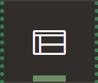
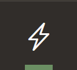
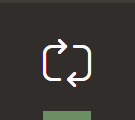
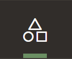

# APEX Build Guide — Multi-Tenant Service Desk

Step-by-step walkthrough for building the service desk in APEX. Follow the steps in order —
each guide tells you exactly what to click, what SQL to paste, and what to test before moving on.

## Page Map

| Page # | Name | Type | Priority |
|--------|------|------|----------|
| 0 | Global Page | System | exists |
| 1 | Home | Blank / Cards | MUST (exists) |
| 2 | Dashboard | Cards + Charts | MUST |
| 3 | Ticket Queue | Faceted Search | MUST |
| 4 | Ticket Detail | Form + regions | MUST |
| 5 | Raise Ticket | Modal Form | MUST |
| 6 | Assign Ticket | Modal Form | MUST |
| 7 | Add Comment | Modal Form | MUST |
| 8 | Companies | Interactive Grid | MUST |
| 9 | Users | Interactive Grid | MUST |
| 10 | Projects | Interactive Report | MUST |
| 11 | Project Detail | Tabbed hub | MUST |
| 12 | My Company | Tabbed hub | SHOULD |
| 13 | Categories | Interactive Grid | SHOULD |
| 14 | My Profile | Form | SHOULD |
| 15 | SLA Policies | Master-detail | SHOULD |
| 16 | Agent-Project Mapping | Interactive Grid | SHOULD |
| 17 | Audit Log | Interactive Report | SHOULD |
| 20 | Switch Role | Modal Dialog | utility |
| 9999 | Login Page | Login | exists |

## Before You Start

- The design source of truth is `docs/ticketing-system-brief.md`
- The visual reference is the mockup prototype: <https://apex-demo.dhawilabs.com> (source: `docs/mockups/`)
- SQL scripts live in `sql/` — run them first (see Step 0)

## Reading Page Designer (read this once)

Almost every step happens in **Page Designer** (open a page from App Builder). It has **three panes**, and the guides point you to them with a shorthand like `[Right Pane ▸ Source ▸ SQL Query]`. Learn these once and every step is unambiguous.

**LEFT pane — the component tree.** Four tabs across the top, shown **icon-only** (hover for the label):

| Tab | Icon | What lives here |
|-----|------|-----------------|
| **Rendering** |  | Regions, page items, buttons — everything drawn on the page |
| **Dynamic Actions** |  | Client-side behaviour (on-change, on-click, …) |
| **Processing** |  | Server-side page logic: **Processes, Computations, Validations, Branches**. ⚠️ Icon-only, 3rd from the left — this is where "add a process" always means |
| **Page Shared Components** |  | Shared components this page references |

**CENTRAL pane — Layout + Gallery.** The **Layout** grid (WYSIWYG) is the working area. At the **bottom** is the **Gallery** with three tabs — **Regions · Items · Buttons** — the drag source: drag a *new* component up onto the Layout to create it.

**RIGHT pane — the Property Editor.** Edits the **attributes** of whatever is selected. Attributes are organised into collapsible **groups** (Oracle's term — informally "sections"): commonly **Identification · Source · Layout · Appearance · Server-side Condition · Validation · Security · Advanced**. Use the **Filter Properties** box to find one fast.

**Shorthand used in the guides** (`▸` = pane → group → attribute):
- `[Left Pane ▸ Rendering]` — select/create a region, item, or button
- `[Left Pane ▸ Processing]` — create a process / computation / validation / branch
- `[Left Pane ▸ Dynamic Actions]` — work with a dynamic action
- `[Central Pane ▸ Gallery ▸ Items]` (or `▸ Regions` / `▸ Buttons`) — drag a **new** component onto the Layout
- `[Right Pane ▸ Group ▸ Attribute]` — set a property, e.g. `[Right Pane ▸ Source ▸ SQL Query]`, `[Right Pane ▸ Security ▸ Authorization Scheme]`

> "Group" = the collapsible heading in the right pane; "attribute" = the individual field inside it.

---

## Reading the Create Page wizard (read this once)

Every page starts the same way: open the app in **App Builder**, click the green **Create Page**
button (top-right), and pick a **page-type tile** (Form, Interactive Grid, Interactive Report,
Faceted Search, Master Detail, Blank Page, …). That launches a short wizard, and each guide's
**Step 1** walks its screens field-by-field. A few things hold for *every* wizard, so the guides
don't repeat them:

- **Screen 1 is always the same shape** — Page Definition (Page Number, Name, Page Mode) + (for
  data-bound pages) Data Source + Navigation. APEX may present these as one screen or as a couple of
  sub-panels you click **Next** through — either way the fields are identical; set them and continue.
- **Table / View Owner** always defaults to your workspace schema (e.g. `WKSP_DHAWIWORKSPACE`) —
  **leave it as the default**. The guides never hardcode it.
- **Navigation toggles** (Use Breadcrumb / Use Navigation) = **Off** on every page — the left nav
  menu is built last, in Step 19.
- **Blank Page** has *no* Data Source screen — you get an empty page and build its regions by hand
  (used for dashboards and tabbed hubs).
- After **Create Page** you land in **Page Designer**; each guide's Step 1 ends with a "what you land
  on" note so you know what the wizard generated before the later steps refine it.

---

## Build Order

### Phase 0 — Foundation (do first)

| Step | Page | Guide | What it sets up |
|------|------|-------|-----------------|
| 0 | DB Setup | [`00-database-setup.md`](00-database-setup.md) | Schema, seed data, isolation views, APEX accounts |
| 1 | Login (p9999) + Security | [`01-login.md`](01-login.md) | Auth scheme, 6 app items, post-auth process, 4 authorization schemes |
| 1b | Outlook / M365 Login | [`01b-outlook-sso.md`](01b-outlook-sso.md) | *Optional.* Microsoft Entra Social Sign-In alongside APEX Accounts — pure config, reuses the Step 1 post-auth proc (keys on email, fails closed). Needs Entra admin + a real M365 mailbox; **not** the demo login |
| 2 | Home (p1) + App Shell | [`02-home.md`](02-home.md) | Combined banner + role switcher (nav bar → p20). Left nav menu deferred to Step 19 |

### Phase 1 — Ticket Spine (the demo core)

| Step | Page | Guide | What it builds |
|------|------|-------|----------------|
| 3 | Ticket Queue (p3) | [`03-ticket-queue.md`](03-ticket-queue.md) | Faceted Search on `V_MY_TICKETS` |
| 4 | Ticket Detail (p4) | [`04-ticket-detail.md`](04-ticket-detail.md) | Form + status buttons + comments + history |
| 5 | Raise Ticket (p5) | [`05-raise-ticket.md`](05-raise-ticket.md) | Modal form with role-scoped project LOV |
| 6 | Assign Ticket (p6) | [`06-assign.md`](06-assign.md) | Modal with tier-based agent LOV |
| 7 | Add Comment (p7) | [`07-add-comment.md`](07-add-comment.md) | Modal with internal-note flag |

### Phase 2 — Dashboard

| Step | Page | Guide | What it builds |
|------|------|-------|----------------|
| 8 | Dashboard (p2) | [`08-dashboard.md`](08-dashboard.md) | KPI cards + charts (needs ticket data flowing) |

### Phase 3 — Admin Pages

| Step | Page | Guide | What it builds |
|------|------|-------|----------------|
| 9 | Companies (p8) | [`09-companies.md`](09-companies.md) | IG for tenant management |
| 10 | Users (p9) | [`10-users.md`](10-users.md) | IG + role management + APEX account creation |
| 11 | Projects (p10) | [`11-projects.md`](11-projects.md) | IR for project browsing |
| 12 | Project Detail (p11) | [`12-project-detail.md`](12-project-detail.md) | Tabbed hub: team, SLA, categories, invitations |

### Phase 4 — Polish (SHOULD pages, time permitting)

| Step | Page | Guide | What it builds |
|------|------|-------|----------------|
| 13 | My Company (p12) | [`13-my-company.md`](13-my-company.md) | Company hub for clients + admin drill-down |
| 14 | Categories (p13) | [`14-categories.md`](14-categories.md) | IG for global category management |
| 15 | My Profile (p14) | [`15-profile.md`](15-profile.md) | User's own details + agent tier display |
| 16 | SLA Policies (p15) | [`16-sla-policies.md`](16-sla-policies.md) | Master-detail for policies + targets |
| 17 | Agent-Project Mapping (p16) | [`17-agent-projects.md`](17-agent-projects.md) | Global IG for agent coverage |
| 18 | Audit Log (p17) | [`18-audit-log.md`](18-audit-log.md) | Admin action transparency |

### Phase 5 — Wire It Together (do last)

| Step | Page | Guide | What it builds |
|------|------|-------|----------------|
| 19 | Left Navigation Menu | [`19-navigation.md`](19-navigation.md) | Role-scoped nav menu linking all pages — built last, once every page exists |

## Irreducible Demo Spine

If time gets tight, these pages alone cover all four judge non-negotiables
(role-based access, multiple companies, assignment, dashboard):

**p1 (Home), p2 (Dashboard), p3 (Queue), p4 (Detail), p5 (Raise), p6 (Assign), p8 (Companies), p9 (Users), p10 (Projects)**

## The Two Rules Every Page Obeys

1. **Read rule** — every region showing ticket data selects `FROM V_MY_TICKETS / V_MY_COMMENTS /
   V_MY_HISTORY / V_MY_ATTACHMENTS`, never the base tables.
2. **Write rule** — every process that writes ticket data first verifies:
   `SELECT COUNT(*) FROM V_MY_TICKETS WHERE TICKET_ID = :Pn_TICKET_ID` must be `> 0`.

Each guide ends with an **Isolation Checklist** — run through it before moving on.
Run the `tenant-isolation-auditor` agent over each page before demoing.
